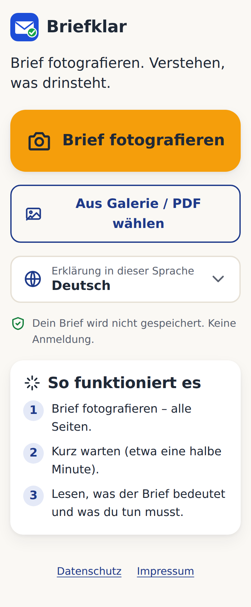
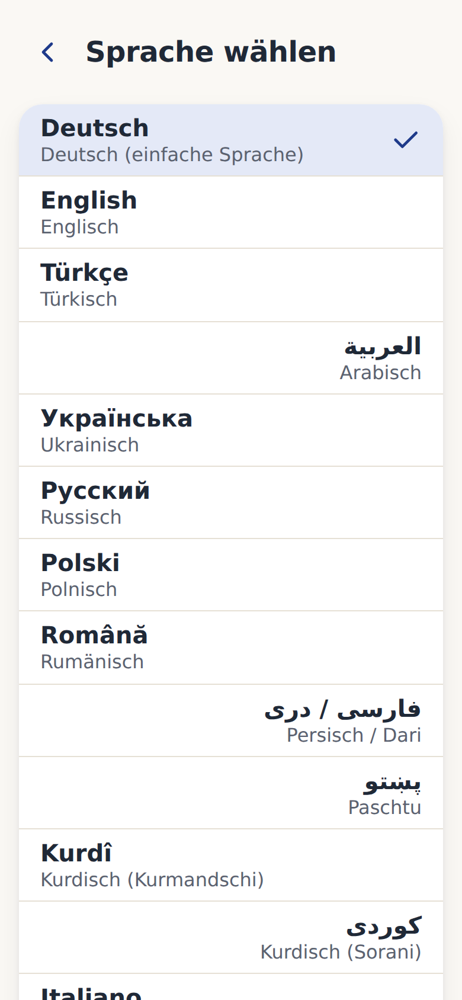
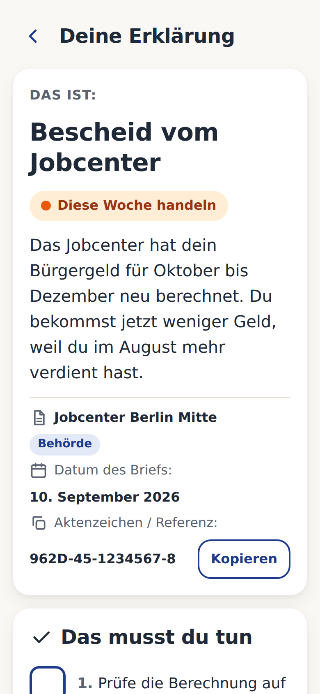
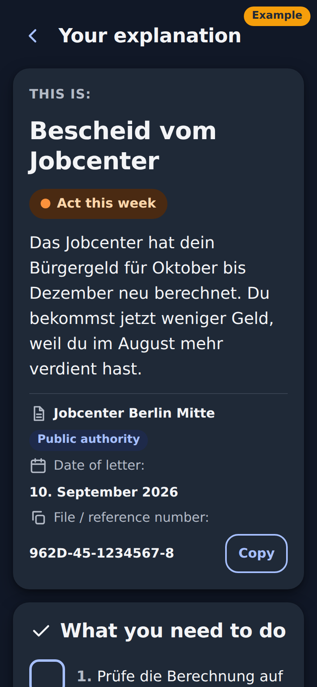

# Briefklar

**Behördenbrief fotografieren – in einfacher Sprache verstehen, in deiner Sprache.**

Briefklar ist eine mobile Web-App (PWA, später Android-App) für Menschen, die Amtsdeutsch schwer verstehen: Neuzugewanderte, Geflüchtete, ältere Menschen, Menschen mit Lernschwierigkeiten – und alle, die einen Brief vom Jobcenter, von der Ausländerbehörde, vom Finanzamt oder einer Inkassofirma einfach mal erklärt bekommen wollen. Foto machen, Sprache wählen (48 Sprachen), Erklärung lesen: Wer schreibt, worum es geht, welche Fristen gelten, was zu tun ist, ob es Betrug sein könnte und wo es kostenlose Hilfe gibt.

Die App ist **keine Rechtsberatung** (siehe [Disclaimer](#disclaimer)).

## Screenshots

| Start | Sprachen | Ergebnis | Dunkel |
|---|---|---|---|
|  |  |  |  |

Beispiel-Ergebnis ohne API: `http://localhost:5173/?demo=1` (auch `&lang=ar` für RTL).

## Architektur

```
 ┌─────────────────────────┐        multipart POST /api/explain        ┌─────────────────────────┐
 │  apps/web  (PWA)        │  ───────────────────────────────────────▶ │  apps/api  (Node/Hono)  │
 │  Kamera / Datei-Upload  │   Bilder (≤4, ≤8 MB) + language           │  Validierung, Rate-Limit│
 │  Sprachauswahl          │                                           │  Bilder nur im RAM      │
 │  Ergebnis-Ansicht       │  ◀─────────────────────────────────────── │  Kein Speichern, kein   │
 │  localStorage: Sprache  │        JSON  ExplainResult                │  Logging von Inhalten   │
 └─────────────────────────┘                                           └───────────┬─────────────┘
              ▲                                                                    │ Anthropic SDK
              │  Android: Trusted Web Activity (Bubblewrap)                        │ (HTTPS, USA)
              │  rendert dieselbe PWA, kein eigener Code                           ▼
 ┌─────────────────────────┐                                           ┌─────────────────────────┐
 │  packages/shared        │  ◀── Zod-Schema + Sprachliste, von        │  Claude API             │
 │  schema.ts, languages.ts│      Web und API gemeinsam genutzt        │  claude-opus-5 (Vision) │
 └─────────────────────────┘                                           └─────────────────────────┘
```

Die API schickt das Foto zusammen mit einem festen System-Prompt (`apps/api/src/prompt.ts`) an Claude und erzwingt eine strukturierte Antwort nach `ExplainResult` (`packages/shared/src/schema.ts`): Zusammenfassung, Bedeutung, Dringlichkeit, Fristen, Handlungsschritte, Geld, Widerspruchsmöglichkeit, Glossar, Hilfestellen, Betrugsrisiko, Konfidenz.

## Quick Start

Voraussetzungen: Node.js ≥ 20, ein Anthropic API-Key (siehe `docs/betrieb.md`).

```bash
git clone <repo-url> briefklar && cd briefklar
npm install
npm run build -w @briefklar/shared        # Schema/Sprachen einmal bauen

cp apps/api/.env.example apps/api/.env   # dann ANTHROPIC_API_KEY eintragen
export ANTHROPIC_API_KEY=sk-ant-...       # oder in apps/api/.env

npm run dev:api                           # API auf http://localhost:8787
npm run dev:web                           # Web-App auf http://localhost:5173 (Proxy → API)
```

Umgebungsvariablen der API:

| Variable | Pflicht | Standard | Bedeutung |
|---|---|---|---|
| `ANTHROPIC_API_KEY` | ja | – | Anthropic API-Key |
| `RATE_LIMIT_PER_15MIN` | nein | `20` | Anfragen pro IP-Adresse und 15 Minuten (im RAM) |
| `CORS_ORIGIN` | nein | `*` (dev) | Erlaubte Origin der Web-App |
| `STATIC_DIR` | nein | – | Wenn gesetzt: gebaute Web-App wird von der API ausgeliefert (Produktion) |
| `PORT` | nein | `8787` | Port der API |

## Tests und Checks

```bash
npm test                                  # vitest in allen Workspaces
npm run typecheck                         # tsc --noEmit in allen Workspaces
npm run build                             # shared → api → web
npm run test -w @briefklar/api            # nur API-Tests (Schema, Prompt, Fehlerformat)
```

## Ordnerstruktur

```
briefklar/
├── apps/
│   ├── api/            Node-API (Hono): POST /api/explain, Rate-Limit, Anthropic-Aufruf
│   │   ├── src/prompt.ts   System-Prompt (stabil halten → Prompt-Caching)
│   │   └── test/
│   └── web/            PWA (Kamera, Upload, Sprachwahl, Ergebnis, Hinweisdialog)
├── packages/
│   └── shared/         Zod-Schema (ExplainResult, ApiError, LIMITS) + Sprachliste
├── docs/
│   ├── datenschutz.html    DSGVO-Datenschutzerklärung (Web + Android)
│   ├── impressum.html      Impressum, Haftung, „Keine Rechtsberatung“
│   ├── nutzungshinweise.md In-App-Hinweis in 6 Sprachen
│   ├── play-store.md       Google-Play-Eintrag, Data-Safety, Screenshots
│   └── betrieb.md          Kosten, Deployment (Render), TWA/Bubblewrap, Finanzierung
├── Dockerfile          Produktions-Image (API liefert Web-Build aus)
└── package.json        npm-Workspaces, Scripts
```

## Datenschutz-Prinzipien

1. **Nichts speichern.** Bilder und Erklärungen werden nur im Arbeitsspeicher verarbeitet, nie auf Datenträger geschrieben, nie in Logs.
2. **Kein Konto, kein Tracking, keine Werbung.** Einzige lokale Daten: gewählte Sprache und „Hinweis gelesen“ im `localStorage`.
3. **Nur ein Empfänger.** Bilder gehen ausschließlich an die Anthropic-API (kein Training auf API-Daten; Aufbewahrung durch Anthropic zur Missbrauchserkennung in der Regel bis zu 30 Tage – ehrlich kommunizieren, kein „Zero Retention“ versprechen).
4. **Datensparsame Ausgabe.** Der Prompt verbietet dem Modell, unnötige persönliche Daten (Adresse, Geburtsdatum, Sozialversicherungsnummer) zu wiederholen.
5. **Der Nutzer entscheidet.** Vor dem ersten Upload erscheint der Hinweis „Wichtig, bevor du startest“ mit der Empfehlung, nicht benötigte Angaben abzudecken; das aktive Hochladen ist die Einwilligung nach Art. 9 Abs. 2 lit. a DSGVO.
6. **Logs ohne Inhalte.** Nur Zeitstempel, Dauer, Seitenzahl, Sprache, Token-Zahlen, Fehlercodes. IP-Adressen nur flüchtig fürs Rate-Limit.
7. **Transport verschlüsselt.** HTTPS überall; Größen- und Anzahlgrenzen (`LIMITS` in `packages/shared`).
8. **Keine automatisierte Entscheidung.** Die Erklärung ist eine Hilfe, keine Entscheidung; das Modell soll bei Unsicherheit „steht nicht im Brief“ sagen statt zu raten.

## Roadmap

| Version | Inhalt |
|---|---|
| **v0.1** | PWA: Foto/Upload (≤ 4 Seiten, PDF), 48 Sprachen, strukturierte Erklärung, Termine in den Kalender (.ics), Fristen als Erinnerung, Anrufen/E-Mail/Route zum Absender, GiroCode für Überweisungen, Betrugswarnung, Hilfestellen, Vorlesen, Rate-Limit, Docker/Render-Deployment |
| **v0.2** | Android-App als Trusted Web Activity (Bubblewrap), Play-Store-Eintrag, `assetlinks.json`, Spenden-Link |
| **v0.2.5** | Native Hülle mit Capacitor für iOS + Android: Apple-Dokumentenscanner (VisionKit, automatischer Zuschnitt, Mehrseiten) und Android ML Kit Document Scanner, App Store-Eintrag |
| **v0.3** | Antwort-Vorlagen und Widerspruchs-Generator: einfache Schreiben (Widerspruch, Fristverlängerung, Ratenzahlung) mit Aktenzeichen vorausgefüllt – als Text zum Kopieren, mit deutlichem Hinweis auf Beratungsstellen |
| **v0.4** | Beratungsstellen-Suche per PLZ (MBE/JMD, Verbraucherzentrale, Schuldnerberatung) mit Öffnungszeiten und Sprachen |
| später | Offline-Glossar, Pro-Zugang für Beratungsstellen |

## Rechtliches für den Betrieb

- `docs/impressum.html` und `docs/datenschutz.html` enthalten gelb markierte Platzhalter (`[Straße Hausnummer, PLZ Ort]`, Hoster, Aufsichtsbehörde, Datum). **Impressum (§ 5 DDG) und DSGVO (Art. 13) verlangen eine ladungsfähige Anschrift** – ein Postfach oder nur eine E-Mail-Adresse reicht nicht. Vor Veröffentlichung ausfüllen und beide Seiten aus der App verlinken.
- Mit Anthropic und dem Hoster jeweils den Auftragsverarbeitungsvertrag (DPA) akzeptieren.

## Lizenz

MIT – siehe `LICENSE`. Beiträge willkommen; bitte keine echten Briefe als Testdaten committen.

## Disclaimer

Briefklar ist ein technisches Hilfsmittel und **keine Rechtsdienstleistung** im Sinne des Rechtsdienstleistungsgesetzes. Die Erklärungen werden von einem KI-Modell erzeugt und können fehlerhaft oder unvollständig sein – besonders bei Fristen, Beträgen und rechtlichen Folgen. Maßgeblich ist immer der Originalbrief. Bei Gerichtspost, Kündigung, aufenthaltsrechtlichen Entscheidungen oder hohen Forderungen sofort eine Beratungsstelle oder eine Anwältin / einen Anwalt aufsuchen. Die Nutzung erfolgt auf eigene Verantwortung; eine Haftung für Schäden aus der Nutzung ist im gesetzlich zulässigen Rahmen ausgeschlossen.
