# FahrPilot: User Flows

Stand: September 2026. Jeder Flow beschreibt Auslöser, nummerierte Schritte mit Systemreaktion, Fehlerfälle und ein Mermaid-Diagramm. Bezeichnungen der Tabellen und Packages entsprechen 00-spezifikationsanalyse.md und 01-informationsarchitektur.md. „Client" bezeichnet apps/mobile oder apps/web, „API" die Supabase-Schnittstelle mit RLS, „Edge" eine Supabase Edge Function.

## Flow 1: Digitale Anmeldung und Onboarding

Auslöser: Büro nimmt einen neuen Schüler auf oder der Schüler startet die Anmeldung über einen Einladungslink der Fahrschule.

1. Büro öffnet „Digitale Anmeldung" oder erzeugt einen Einladungslink (Gültigkeit konfigurierbar, Standard 14 Tage). System speichert die Einladung mit Token-Hash in invitations.
2. Schüler öffnet den Link, gibt Stammdaten, Geburtsdatum, gewünschte Klasse, Ersterwerb oder Erweiterung, Vorbesitz ein. System validiert Pflichtfelder und Mindestalter je Klasse (Regel aus rule_versions, Wert fachlich zu verifizieren); bei Alter unter 18 wird der Abschnitt Erziehungsberechtigte Pflicht.
3. Schüler liest und bestätigt Einwilligungen (Datenschutz, Kommunikation, ggf. Standort für Check-in). System speichert consents mit consent_text_id, Zeitstempel, Kanal und IP-Hash.
4. Bei Minderjährigen erhält der Guardian eine E-Mail mit Bestätigungslink. System setzt students.status auf pending_guardian bis zur Bestätigung.
5. System legt users, students, student_licenses (acquisition_type) und die initiale Dokumenten-Checkliste aus document_checklist_templates je Klasse an; Audit-Trigger schreibt audit_logs.
6. Schüler setzt Passwort und legt eine App-Sprache fest. System sendet Willkommensbenachrichtigung (inbox, email) und startet den Heute-Modus mit den Aufgaben „Dokumente hochladen" und „Erste Lerneinheit".
7. Büro sieht den Schüler in der Liste mit Status active oder pending_guardian.

Fehlerfälle: Link abgelaufen (Büro erzeugt neuen); E-Mail bereits registriert (Angebot Login und Verknüpfung mit neuem Tenant über tenant_memberships); Guardian bestätigt nicht innerhalb von 14 Tagen (Erinnerung, dann Hinweis ans Büro); Klasse ohne freigegebene Regelversion (Anmeldung möglich, Lernbereich zeigt „in fachlicher Prüfung").

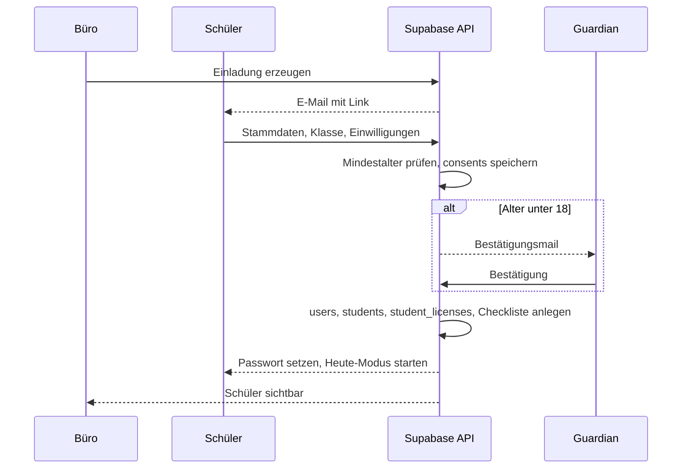
```mermaid
sequenceDiagram
    participant B as Büro
    participant S as Schüler
    participant API as Supabase API
    participant G as Guardian
    B->>API: Einladung erzeugen
    API-->>S: E-Mail mit Link
    S->>API: Stammdaten, Klasse, Einwilligungen
    API->>API: Mindestalter prüfen, consents speichern
    alt Alter unter 18
        API-->>G: Bestätigungsmail
        G->>API: Bestätigung
    end
    API->>API: users, students, student_licenses, Checkliste anlegen
    API-->>S: Passwort setzen, Heute-Modus starten
    API-->>B: Schüler sichtbar
```

## Flow 2: Login und Rollenwahl

1. Nutzer gibt E-Mail und Passwort ein (Web: optional Passkey). System prüft Anmeldedaten über Supabase Auth; office, admin und owner benötigen einen zweiten Faktor (TOTP).
2. Custom-Access-Token-Hook liest tenant_memberships des Nutzers. Bei genau einer Mitgliedschaft schreibt er tenant_id und role in das JWT.
3. Bei mehreren Mitgliedschaften zeigt der Client die Tenant-Auswahl; nach Auswahl fordert der Client ein neues Token mit active_tenant_id an. Hook prüft, dass die Mitgliedschaft aktiv ist, und schreibt tenant_id und role ins JWT.
4. Client leitet auf die Startseite der Rolle (Schüler: Heute, Fahrlehrer: Heute, Büro: Übersicht, Plattform-Admin: CMS).
5. Bei neuem Gerät sendet das System account.security an inbox und email.

Fehlerfälle: Mitgliedschaft deaktiviert (Fehlermeldung ohne Preisgabe, welche Fahrschule); zweiter Faktor fehlt bei Büro-Rolle (Einrichtung erzwungen); Token abgelaufen (stille Erneuerung, bei Fehlschlag Logout mit Erhalt der Sync-Queue).

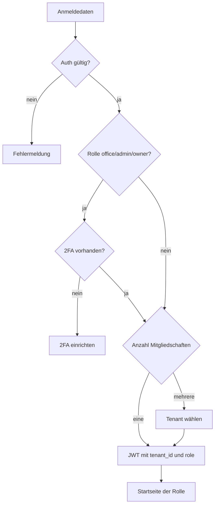
```mermaid
flowchart TD
    A[Anmeldedaten] --> B{Auth gültig?}
    B -- nein --> E[Fehlermeldung]
    B -- ja --> C{Rolle office/admin/owner?}
    C -- ja --> D{2FA vorhanden?}
    D -- nein --> F[2FA einrichten]
    D -- ja --> G
    C -- nein --> G{Anzahl Mitgliedschaften}
    G -- eine --> H[JWT mit tenant_id und role]
    G -- mehrere --> I[Tenant wählen] --> H
    H --> J[Startseite der Rolle]
```

## Flow 3: Heute-Modus

1. Schüler öffnet die App. Client lädt Termine, Prüfungsstatus und Lernstand (lokal aus SQLite, dann Sync).
2. learning-engine berechnet die Tagesliste: fällige Wiederholungen (Spaced Repetition), Schwachstellen mit niedrigstem Mastery Score, Vorbereitung auf die nächste Fahrstunde (Theoriethemen, die zum geplanten Stundentyp und zu dokumentierten Praxisschwächen gehören), offene Dokumente, anstehende Prüfungen.
3. Priorisierung: Termine und Fristen zuerst, dann Kopplungsaufgaben aus dem Kompetenzprofil, dann Wiederholungen, dann Tagesziel.
4. Schüler startet eine Aufgabe. System öffnet den passenden Lernmodus mit vorgefilterter Fragenmenge und protokolliert learning_sessions.
5. Nach Abschluss aktualisiert der Client die Liste ohne Neuladen; erledigte Aufgaben bleiben abgehakt sichtbar.

Fehlerfälle: Keine Aufgaben (gestalteter Leerzustand mit Aktion); Offline (Liste aus lokalem Stand, Termine mit Sync-Zeitstempel); Regelversion für Prüfungsreife fehlt (Ampel ausgeblendet mit Hinweis statt Fantasiewert).

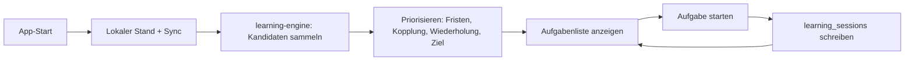
```mermaid
flowchart LR
    A[App-Start] --> B[Lokaler Stand + Sync]
    B --> C[learning-engine: Kandidaten sammeln]
    C --> D[Priorisieren: Fristen, Kopplung, Wiederholung, Ziel]
    D --> E[Aufgabenliste anzeigen]
    E --> F[Aufgabe starten]
    F --> G[learning_sessions schreiben]
    G --> E
```

## Flow 4: Lernen nach Themen

1. Schüler wählt im Tab Lernen „Themen". System lädt Themen mit Mastery Score und Anzahl Fragen; amtliche Fragen erscheinen nur, wenn tenant_licenses eine aktive Lizenz enthält (RLS-Bedingung), sonst nur eigene Übungsfragen mit Hinweis.
2. Schüler wählt ein Thema. Client lädt die aktuell gültige question_version je Frage (review_status published, valid_from bis valid_until) und zeigt den Rechtsstand.
3. Schüler beantwortet eine Frage. Client speichert student_question_attempts lokal mit Idempotenzschlüssel (student_id, question_version_id, client_attempt_id) und zeigt sofort die Korrektur mit Fehlerpunkten.
4. learning-engine aktualisiert Mastery Score des Themas und plant die nächste Wiederholung.
5. Schüler kann die Frage markieren oder den Warum-Button (A2) öffnen.
6. Am Ende zeigt der Client die Sitzungsstatistik und aktualisiert das Tagesziel.

Fehlerfälle: Frage hat inzwischen eine neue Version (alte Version bleibt in der laufenden Sitzung, Hinweis beim nächsten Start); Sync schlägt fehl (Versuche bleiben in Queue, Anzeige „nicht synchronisiert"); Lizenz abgelaufen während der Sitzung (Sitzung endet mit Hinweis, Fortschritt bleibt erhalten).

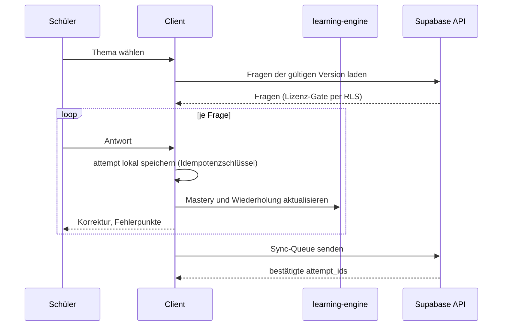
```mermaid
sequenceDiagram
    participant S as Schüler
    participant C as Client
    participant LE as learning-engine
    participant API as Supabase API
    S->>C: Thema wählen
    C->>API: Fragen der gültigen Version laden
    API-->>C: Fragen (Lizenz-Gate per RLS)
    loop je Frage
        S->>C: Antwort
        C->>C: attempt lokal speichern (Idempotenzschlüssel)
        C->>LE: Mastery und Wiederholung aktualisieren
        C-->>S: Korrektur, Fehlerpunkte
    end
    C->>API: Sync-Queue senden
    API-->>C: bestätigte attempt_ids
```

## Flow 5: Prüfungssimulation mit Ergebnisanalyse

1. Schüler startet die Simulation. Client fragt rules-engine nach der gültigen rule_version (rule_type theory_exam, license_class, acquisition_type, Datum heute). Ohne freigegebene Version ist der Start nicht möglich.
2. rules-engine liefert Parameter: Fragenanzahl, Verteilung Grund-/Zusatzstoff, maximale Fehlerpunkte, Durchfallregeln, Zeitlimit. Für Klasse B Ersterwerb: 30 Fragen (20 Grundstoff, 10 Zusatzstoff), maximal 10 Fehlerpunkte, Durchfall bei zwei Fragen mit je 5 Fehlerpunkten. Andere Klassen: fachlich zu verifizieren.
3. Client zieht Fragen gemäß Verteilung aus den gültigen Versionen und legt exam_simulations mit rule_version_id an.
4. Schüler beantwortet unter Zeitlimit. Bei Ablauf wird automatisch abgegeben.
5. rules-engine berechnet das Ergebnis deterministisch aus Antworten und Regelparametern; exam_results speichert Ergebnis, Fehlerpunkte, Grund-/Zusatzstoff getrennt, rule_version_id.
6. Ergebnisanalyse zeigt: bestanden/nicht bestanden, Fehlerpunkte je Themengruppe, Durchfallregel falls ausgelöst, Empfehlung. learning-engine aktualisiert den Prüfungsreife-Score.
7. Schüler kann falsche Fragen direkt üben.

Fehlerfälle: App-Abbruch (Simulation lokal gesichert, Fortsetzung mit verbleibender Zeit, sonst Status aborted); Regelversion wechselt während der Simulation (die beim Start gebundene Version bleibt maßgeblich); Fragenpool zu klein für die Verteilung (Start verweigert mit Hinweis, kein Auffüllen mit Fremdklassen).

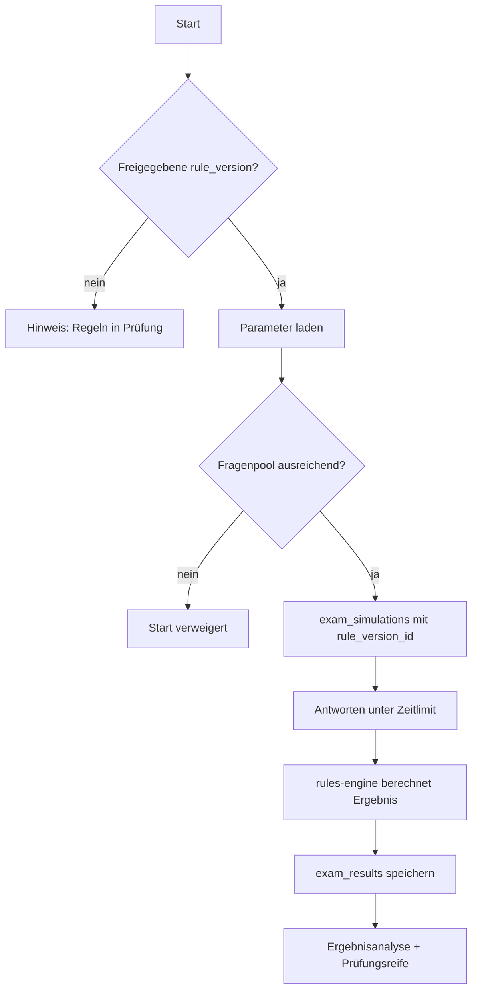
```mermaid
flowchart TD
    A[Start] --> B{Freigegebene rule_version?}
    B -- nein --> X[Hinweis: Regeln in Prüfung]
    B -- ja --> C[Parameter laden]
    C --> D{Fragenpool ausreichend?}
    D -- nein --> Y[Start verweigert]
    D -- ja --> E[exam_simulations mit rule_version_id]
    E --> F[Antworten unter Zeitlimit]
    F --> G[rules-engine berechnet Ergebnis]
    G --> H[exam_results speichern]
    H --> I[Ergebnisanalyse + Prüfungsreife]
```

## Flow 6: Warum-Button und KI-Lerncoach (A2)

1. Schüler drückt bei einer Frage „Warum". Client sendet question_version_id und die eigene Antwort an Edge ai-explain; keine weiteren Personendaten.
2. Edge prüft Kontingent in ai_usage (Budget je Tenant und Schüler). Bei Überschreitung: Antwort mit statischer Erklärung aus dem CMS, falls vorhanden, sonst Hinweis.
3. Edge lädt freigegebene knowledge_base-Einträge zum Thema (review_status published) und die CMS-Erklärung der Frage. Der Prompt enthält nur diese Quellen und die Anweisung, ohne Quelle keine Aussage zu treffen.
4. LLM-Antwort wird von packages/ai geprüft: Jede Aussage muss eine Quellen-ID referenzieren; Antworten ohne Referenz werden mit „Unsicher: keine geprüfte Quelle" gekennzeichnet oder verworfen.
5. Client zeigt Erklärung, Quellen mit Rechtsstand und Kennzeichnung. ai_usage wird fortgeschrieben.
6. Im Lerncoach-Chat gilt dasselbe Verfahren; der Coach kann Übungsfragen zu einem Thema vorschlagen (Fehleranalyse), erzeugt aber nie neue Regelwerte.

Fehlerfälle: LLM-Anbieter nicht erreichbar (statische Erklärung, Hinweis); Antwort verletzt Guardrails (Verwerfen, Ereignis in audit_logs, Nutzer sieht Hinweis); Frage ohne Knowledge-Base-Bezug (Coach antwortet ausdrücklich, dass keine geprüfte Quelle vorliegt).

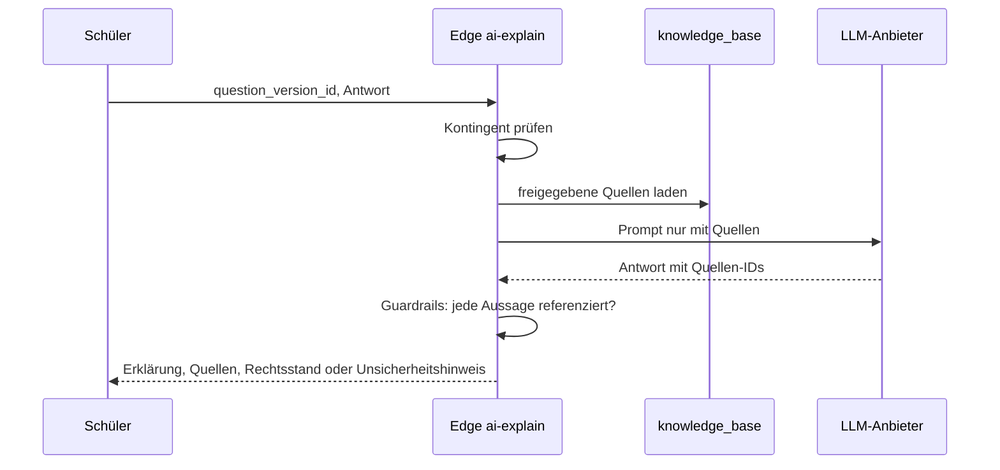
```mermaid
sequenceDiagram
    participant S as Schüler
    participant E as Edge ai-explain
    participant KB as knowledge_base
    participant LLM as LLM-Anbieter
    S->>E: question_version_id, Antwort
    E->>E: Kontingent prüfen
    E->>KB: freigegebene Quellen laden
    E->>LLM: Prompt nur mit Quellen
    LLM-->>E: Antwort mit Quellen-IDs
    E->>E: Guardrails: jede Aussage referenziert?
    E-->>S: Erklärung, Quellen, Rechtsstand oder Unsicherheitshinweis
```

## Flow 7: Fahrstunde buchen mit Konfliktprüfung

1. Schüler öffnet Terminbuchung, wählt Stundentyp (Standard oder Sonderfahrt) und Länge in 45-Minuten-Einheiten. System zeigt nur Fahrlehrer, die dem Schüler zugewiesen sind und die Klasse ausbilden dürfen (instructor_license_classes).
2. System berechnet freie Slots aus instructor_availability abzüglich lessons, Pausen und Urlaub; Fahrzeugverfügbarkeit wird geprüft, falls Fahrzeug an Fahrlehrer gebunden ist.
3. Schüler wählt Slot und bestätigt. Client sendet Buchungsanfrage mit Idempotenzschlüssel.
4. Datenbank fügt lessons und lesson_bookings ein; der Exclusion-Constraint (btree_gist über instructor_id und Zeitraum, sowie vehicle_id und Zeitraum) verhindert Überschneidungen atomar.
5. Bei Erfolg: Benachrichtigung lesson.booked an Schüler und Fahrlehrer, Termin im Kalender aller Beteiligten, Audit-Log.
6. Bei Constraint-Verletzung: API antwortet 409, Client aktualisiert die Slots und zeigt „Termin wurde soeben vergeben".

Fehlerfälle: Schüler hat offene Rechnungen über konfigurierbarer Grenze (Buchung mit Hinweis blockiert, falls Tenant so konfiguriert); Sonderfahrt vor Erreichen der Voraussetzung (Warnung, keine Blockade, da fachlich Fahrlehrerentscheidung); Doppelklick (Idempotenzschlüssel liefert dieselbe Buchung).

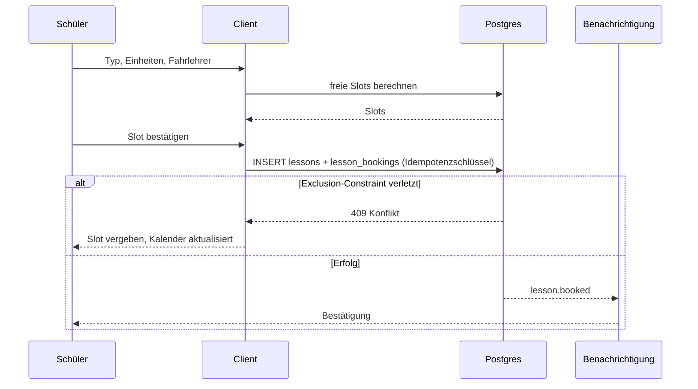
```mermaid
sequenceDiagram
    participant S as Schüler
    participant C as Client
    participant DB as Postgres
    participant N as Benachrichtigung
    S->>C: Typ, Einheiten, Fahrlehrer
    C->>DB: freie Slots berechnen
    DB-->>C: Slots
    S->>C: Slot bestätigen
    C->>DB: INSERT lessons + lesson_bookings (Idempotenzschlüssel)
    alt Exclusion-Constraint verletzt
        DB-->>C: 409 Konflikt
        C-->>S: Slot vergeben, Kalender aktualisiert
    else Erfolg
        DB-->>N: lesson.booked
        N-->>S: Bestätigung
    end
```

## Flow 8: Stornierung mit Regelanwendung

1. Schüler oder Fahrlehrer öffnet Termindetail und wählt „Stornieren". Client zeigt die gültige cancellation_rule des Tenants (Frist, Gebührenlogik, Ausnahmen) und die konkrete Konsequenz für diesen Termin.
2. Nutzer gibt Grund an (Pflichtfeld bei Stornierung innerhalb der Frist) und bestätigt.
3. Edge cancel-lesson berechnet: Zeitpunkt der Stornierung, Abstand zum Termin, zutreffende Regel, ob Gebühr anfällt. Ausnahmen (Krankheit mit Nachweis, Stornierung durch Fahrschule) werden als Status hinterlegt und vom Büro entschieden.
4. System setzt lesson_bookings.status auf canceled, speichert cancellation_events mit Regelversion, berechneter Gebühr und Begründung; Slot wird frei; bei Gebühr wird ein Rechnungsentwurf mit Position „Ausfallgebühr" erzeugt (kein Automatik-Versand, Büro finalisiert).
5. Benachrichtigung lesson.canceled an alle Beteiligten; Warteliste wird geprüft (Flow 9).

Fehlerfälle: Regel nicht konfiguriert (Stornierung ohne Gebühr, Hinweis ans Büro zur Konfiguration); Stornierung durch Fahrschule (nie Gebühr für Schüler, optional Ersatzangebot); Termin bereits begonnen (Stornierung nicht möglich, nur Dokumentation als „nicht erschienen").

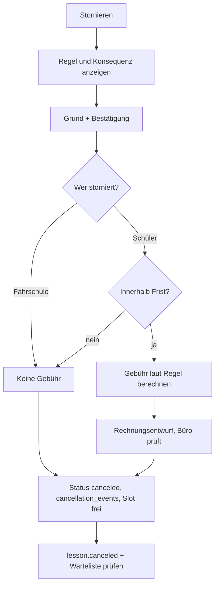
```mermaid
flowchart TD
    A[Stornieren] --> B[Regel und Konsequenz anzeigen]
    B --> C[Grund + Bestätigung]
    C --> D{Wer storniert?}
    D -- Fahrschule --> E[Keine Gebühr]
    D -- Schüler --> F{Innerhalb Frist?}
    F -- nein --> E
    F -- ja --> G[Gebühr laut Regel berechnen]
    G --> H[Rechnungsentwurf, Büro prüft]
    E --> I[Status canceled, cancellation_events, Slot frei]
    H --> I
    I --> J[lesson.canceled + Warteliste prüfen]
```

## Flow 9: Warteliste bei Absage (A2)

1. Schüler trägt sich mit Wunschzeitraum, Fahrlehrer und Stundentyp in waitlist_entries ein.
2. Bei Stornierung (Flow 8) prüft Edge waitlist-match passende Einträge nach Reihenfolge (Eintragungszeit, konfigurierbar auch Prüfungsnähe).
3. Erster Treffer erhält waitlist.offer mit Ablauf (Standard 30 Minuten, konfigurierbar). Der Slot wird für diese Zeit reserviert (lesson_bookings.status hold, Exclusion-Constraint gilt weiterhin).
4. Schüler nimmt an: Buchung wird bestätigt (Flow 7 Schritt 5). Schüler lehnt ab oder Zeit läuft ab: Reservierung wird gelöst, nächster Eintrag wird angeboten.
5. Ohne Treffer bleibt der Slot regulär buchbar.

Fehlerfälle: Zwei Angebote an denselben Schüler (nur ein aktives Angebot je Schüler); Slot vom Büro parallel vergeben (Constraint verhindert, Angebot wird als erledigt markiert).

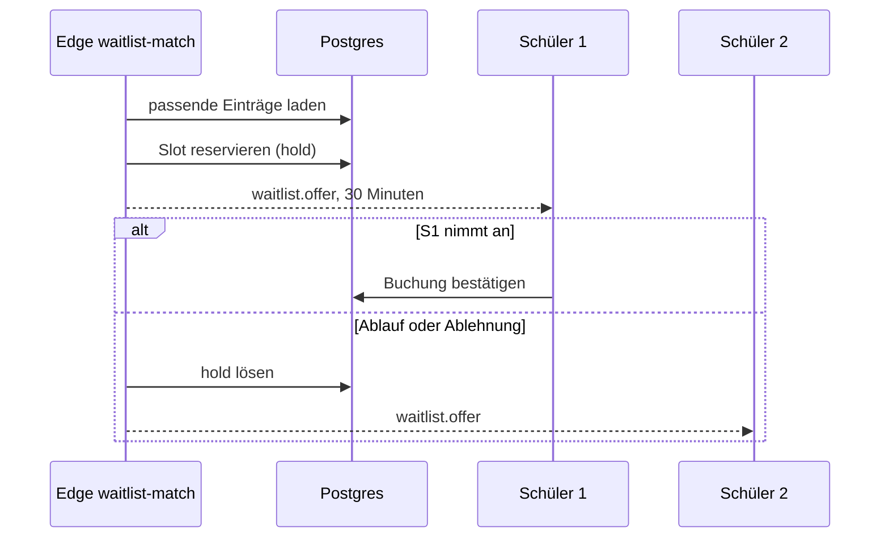
```mermaid
sequenceDiagram
    participant W as Edge waitlist-match
    participant DB as Postgres
    participant S1 as Schüler 1
    participant S2 as Schüler 2
    W->>DB: passende Einträge laden
    W->>DB: Slot reservieren (hold)
    W-->>S1: waitlist.offer, 30 Minuten
    alt S1 nimmt an
        S1->>DB: Buchung bestätigen
    else Ablauf oder Ablehnung
        W->>DB: hold lösen
        W-->>S2: waitlist.offer
    end
```

## Flow 10: Fahrlehrer-Dokumentation nach der Stunde

1. Stunde endet. System sendet nach 30 Minuten evaluation.pending, falls keine Dokumentation vorliegt.
2. Fahrlehrer öffnet Schnell-Dokumentation. Client schlägt Skills nach Stundentyp vor (z. B. Überlandfahrt: Geschwindigkeitsanpassung, Überholen, Vorfahrt außerorts) und zeigt die letzten Bewertungen des Schülers.
3. Fahrlehrer vergibt Sterne je Skill und schreibt optional einen Kommentar; bestätigt Stundentyp und Einheiten (relevant für Ausbildungsnachweis); legt fest, ob der Kommentar für den Schüler sichtbar ist.
4. Optional (A2): Fahrlehrer spricht eine Sprachnotiz. Client lädt Audio an Edge voice-to-doc, erhält Transkript und einen Strukturvorschlag (Skills, Sterne, Kommentar) mit markierten Unsicherheiten. Fahrlehrer korrigiert und bestätigt; erst dann wird gespeichert, das Audio wird gelöscht.
5. System speichert lesson_evaluations (append-only Ereignisse), aktualisiert student_skill_scores (Flow 11) und den Ausbildungsstand über rules-engine.
6. Schüler erhält evaluation.published, sofern sichtbar.

Fehlerfälle: Offline (A2: Queue; MVP: lokale Zwischenspeicherung mit Hinweis); Speech-to-Text nicht verfügbar (manuelle Eingabe); Fahrlehrer ändert Bewertung später (neues Ereignis, altes bleibt im Audit).

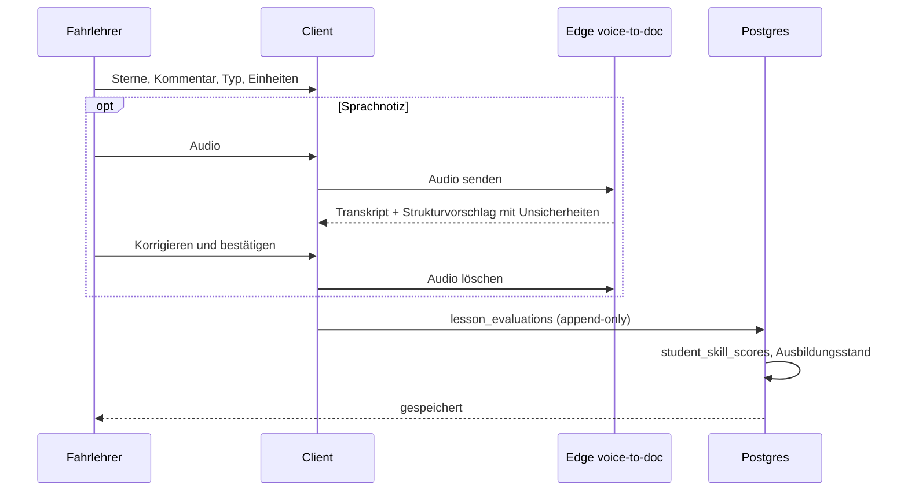
```mermaid
sequenceDiagram
    participant F as Fahrlehrer
    participant C as Client
    participant E as Edge voice-to-doc
    participant DB as Postgres
    F->>C: Sterne, Kommentar, Typ, Einheiten
    opt Sprachnotiz
        F->>C: Audio
        C->>E: Audio senden
        E-->>C: Transkript + Strukturvorschlag mit Unsicherheiten
        F->>C: Korrigieren und bestätigen
        C->>E: Audio löschen
    end
    C->>DB: lesson_evaluations (append-only)
    DB->>DB: student_skill_scores, Ausbildungsstand
    DB-->>F: gespeichert
```

## Flow 11: Kompetenzprofil-Update und Theorie-Praxis-Kopplung

1. Nach Speichern einer Dokumentation berechnet learning-engine je bewertetem Skill den neuen Score (gewichteter gleitender Durchschnitt mit stärkerer Gewichtung neuer Bewertungen) und schreibt student_skill_scores mit Verlauf.
2. Für Skills unter einem Schwellwert (konfigurierbar, Standard 3 von 5 Sternen) ermittelt learning-engine über skill_topic_links die verknüpften Theoriethemen (z. B. Skill „Vorfahrt" zu Thema „Vorfahrt und Verkehrsregelung").
3. System legt eine Heute-Aufgabe „Theorie-Training: Vorfahrt" mit Begründung „aus Fahrstunde vom Datum" an.
4. Umgekehrt: Sinkt der Mastery Score eines Themas unter Schwellwert, erscheint das Thema im Fahrlehrer-Heute-Screen beim nächsten Termin dieses Schülers als „Theorie-Schwäche: Vorfahrt". Anzeige aggregiert, ohne einzelne Fragen.
5. Kompetenzprofil des Schülers zeigt Skills mit Trend und die verknüpften Theorieaufgaben.

Fehlerfälle: Skill ohne Themenverknüpfung (keine Aufgabe, Hinweis im CMS-Report); zu wenige Datenpunkte (Score mit Kennzeichnung „vorläufig").

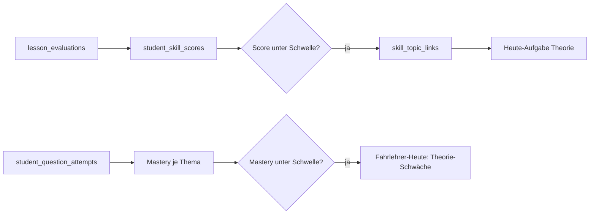
```mermaid
flowchart LR
    A[lesson_evaluations] --> B[student_skill_scores]
    B --> C{Score unter Schwelle?}
    C -- ja --> D[skill_topic_links] --> E[Heute-Aufgabe Theorie]
    F[student_question_attempts] --> G[Mastery je Thema]
    G --> H{Mastery unter Schwelle?}
    H -- ja --> I[Fahrlehrer-Heute: Theorie-Schwäche]
```

## Flow 12: Theorieunterricht mit QR-Check-in und Missbrauchsschutz

1. Büro oder Fahrlehrer startet den Unterricht im Web. System erzeugt checkin_codes: rotierender Code (TOTP-ähnlich, Wechsel alle 30 Sekunden, Gültigkeit 60 Sekunden) als QR-Code auf dem Raumbildschirm.
2. Schüler scannt den Code in der App innerhalb des Zeitfensters (Standard: 15 Minuten vor Beginn bis 15 Minuten nach Beginn, konfigurierbar). Client sendet Code, theory_class_id, Geräte-ID und, falls Tenant Geofence aktiviert hat und Einwilligung vorliegt, das Ergebnis der Standortprüfung (innerhalb/außerhalb, keine Koordinaten).
3. Edge checkin prüft: Code gültig und zur Klasse passend, Zeitfenster, Schüler gehört zum Tenant und zur Klasse, kein Doppel-Check-in, Geräte-ID nicht bereits für einen anderen Schüler in derselben Sitzung verwendet.
4. System speichert attendance mit Zeitstempel und Prüfmerkmalen; Schüler erhält theory.attendance_recorded.
5. Optional Check-out am Ende (zweiter Code) für Nachweis der Anwesenheitsdauer, konfigurierbar.
6. Büro kann Anwesenheit nachträglich korrigieren; Korrektur erfordert Begründung und ist im Audit-Log sichtbar.
7. rules-engine rechnet Anwesenheit auf Grund- und Zusatzstoff je Klasse an (Klasse B: 12 Doppelstunden Grundstoff und 2 Zusatzstoff; andere Klassen fachlich zu verifizieren).

Fehlerfälle: Code abgelaufen (neuer Scan); Zeitfenster überschritten (Ablehnung, Hinweis an Büro zur manuellen Entscheidung); Geräte-ID doppelt (beide Check-ins als „zu prüfen" markiert); Schüler ohne Einwilligung bei aktivem Geofence (Check-in ohne Standort, Kennzeichnung).

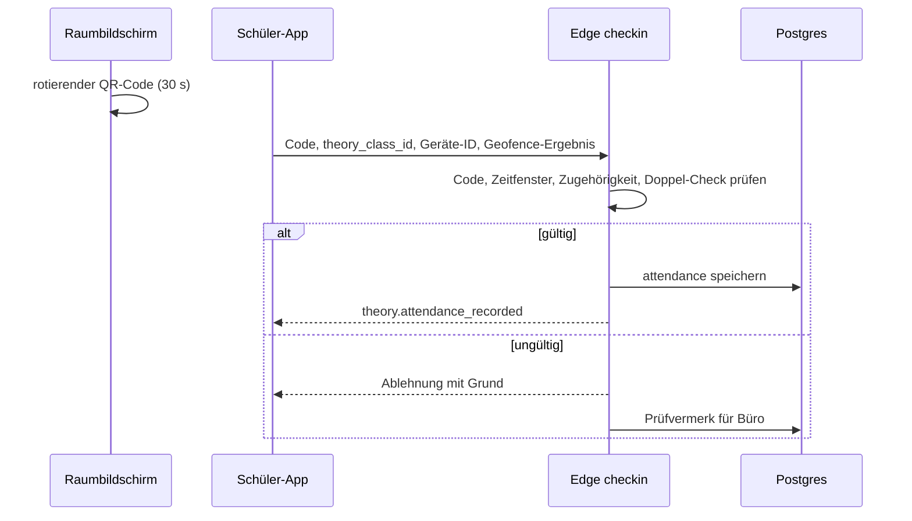
```mermaid
sequenceDiagram
    participant R as Raumbildschirm
    participant S as Schüler-App
    participant E as Edge checkin
    participant DB as Postgres
    R->>R: rotierender QR-Code (30 s)
    S->>E: Code, theory_class_id, Geräte-ID, Geofence-Ergebnis
    E->>E: Code, Zeitfenster, Zugehörigkeit, Doppel-Check prüfen
    alt gültig
        E->>DB: attendance speichern
        E-->>S: theory.attendance_recorded
    else ungültig
        E-->>S: Ablehnung mit Grund
        E->>DB: Prüfvermerk für Büro
    end
```

## Flow 13: Prüfungsplanung mit Statusworkflow

Status: planned, prerequisites_open, registered, confirmed, completed, passed, failed, canceled.

1. Büro legt eine Theorie- oder Praxisprüfung an (theory_exams, practical_exams) mit Wunschtermin. Status planned.
2. System prüft Voraussetzungen über rules-engine und Daten: Dokumente vollständig, Theorieunterricht vollständig, Sonderfahrten vollständig (Praxis), Theorieprüfung bestanden und gültig (Praxis, Gültigkeitsdauer fachlich zu verifizieren), Mindestalter erreicht, keine laufende Wartefrist nach Nichtbestehen (fachlich zu verifizieren), Prüfungsreife-Score als Hinweis (keine Blockade). Fehlende Punkte: Status prerequisites_open mit Liste.
3. Büro meldet den Schüler bei der Prüforganisation an (manuell, außerhalb des Systems) und trägt Termin, Prüfungssprache (aus exam_languages) und Prüfort ein. Status registered.
4. Nach Bestätigung durch die Prüforganisation setzt das Büro confirmed; Countdown startet für Schüler und Fahrlehrer, exam.countdown wird geplant.
5. Nach der Prüfung trägt das Büro das Ergebnis ein (passed/failed, Fehlerpunkte falls bekannt). Bei failed berechnet rules-engine den frühestmöglichen Wiederholungstermin.
6. Bei passed (Praxis) wird student_licenses.status auf completed gesetzt; Ausbildungsnachweis kann finalisiert werden.

Fehlerfälle: Termin vor Erfüllung der Voraussetzungen (Warnung, Buchung erlaubt, da Voraussetzungen bis zum Termin erfüllbar sind; am Tag davor erneute Prüfung mit Warnung); Rechtsstand der Regel ändert sich (Prüfung behält gebundene Regelversion).

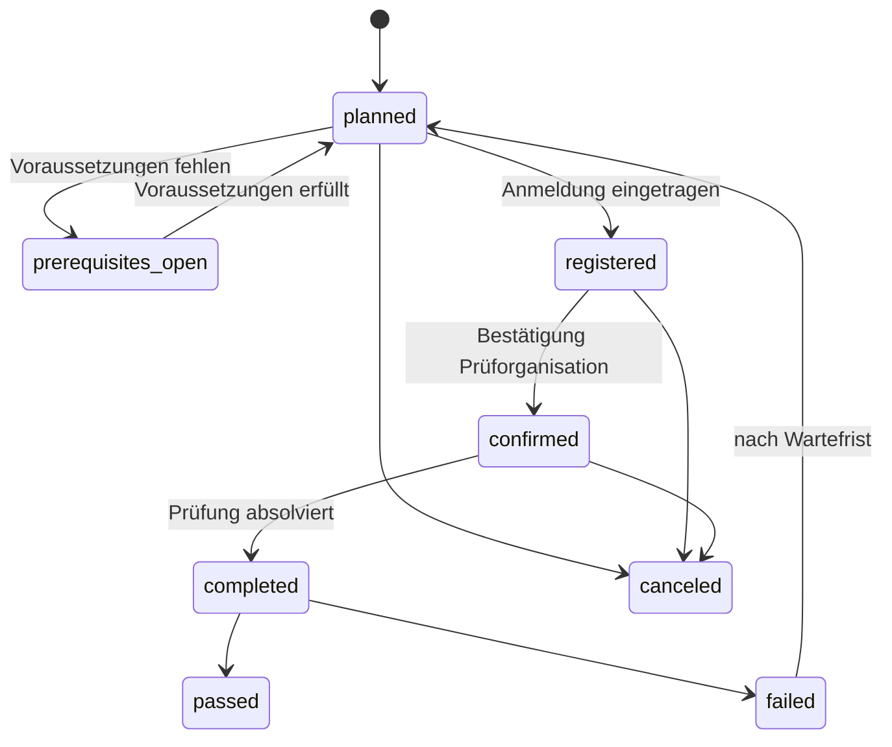
```mermaid
stateDiagram-v2
    [*] --> planned
    planned --> prerequisites_open: Voraussetzungen fehlen
    prerequisites_open --> planned: Voraussetzungen erfüllt
    planned --> registered: Anmeldung eingetragen
    registered --> confirmed: Bestätigung Prüforganisation
    confirmed --> completed: Prüfung absolviert
    completed --> passed
    completed --> failed
    failed --> planned: nach Wartefrist
    planned --> canceled
    registered --> canceled
    confirmed --> canceled
```

## Flow 14: Mock-Prüfung mit Ereignismarkierung (A2)

1. Fahrlehrer startet im Termindetail „Mock-Prüfung". Client zeigt Timer und Ereigniskategorien (aus skills, gruppiert nach Prüfungsrelevanz, Inhalte fachlich zu verifizieren).
2. Während der Fahrt markiert der Fahrlehrer Ereignisse mit einem Tippen (Kategorie, Schwere: Hinweis, Fehler, schwerwiegender Fehler). Zeitstempel wird automatisch gesetzt. Der fahrende Schüler bedient nichts.
3. Nach der Fahrt ergänzt der Fahrlehrer Kommentare je Ereignis und die Gesamteinschätzung (bestanden hätte, nicht bestanden hätte) mit Begründung.
4. System speichert mock_exam_events und lesson_evaluations; Kompetenzprofil wird aktualisiert (Flow 11); schwere Ereignisse erzeugen Theorieaufgaben.
5. Schüler sieht das Protokoll mit Ereignissen und Empfehlungen; KI-Prüfungscoach (A3) kann daraus Vorbereitungspläne ableiten.

Fehlerfälle: App-Abbruch (Ereignisse lokal gesichert); versehentliches Ereignis (löschbar bis Abschluss, danach nur Korrekturvermerk).

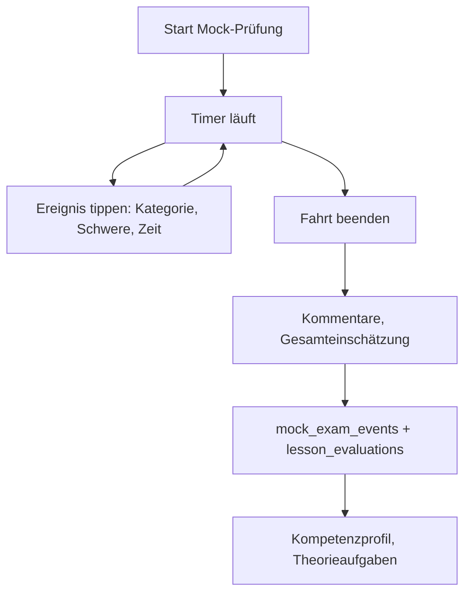
```mermaid
flowchart TD
    A[Start Mock-Prüfung] --> B[Timer läuft]
    B --> C[Ereignis tippen: Kategorie, Schwere, Zeit]
    C --> B
    B --> D[Fahrt beenden]
    D --> E[Kommentare, Gesamteinschätzung]
    E --> F[mock_exam_events + lesson_evaluations]
    F --> G[Kompetenzprofil, Theorieaufgaben]
```

## Flow 15: Rechnung und Zahlung (SEPA-Mandat, Webhook, Mahnstufe)

1. Büro erstellt Rechnungsentwurf aus abgeschlossenen Stunden, Preisliste und weiteren Positionen (Grundgebühr, Vorstellung, Lernmaterial); Steuersatz je Position aus der Preisliste (Regelsteuersatz 19 %, fachlich je Tenant zu verifizieren).
2. Büro finalisiert. Datenbank vergibt die nächste Nummer aus invoice_number_sequences (lückenlos, je Nummernkreis, in einer Transaktion), setzt finalized_at; Trigger verhindert UPDATE und DELETE danach. PDF wird erzeugt und in Storage abgelegt; invoice.created an Schüler und Guardian.
3. Schüler wählt Zahlung. Bei erstmaliger SEPA-Lastschrift (A2) erteilt er das Mandat über den Zahlungsanbieter (Stripe-Adapter in packages/payments); payment_mandates speichert Mandatsreferenz, kein IBAN-Klartext.
4. packages/payments erzeugt beim Anbieter eine Zahlung mit invoice_id als Referenz; payments erhält Status pending.
5. Stripe-Webhook trifft an Edge payments-webhook ein: Signatur wird geprüft, Ereignis-ID gegen verarbeitete Ereignisse abgeglichen (Idempotenz). Bei succeeded: payments.status paid, invoices.status paid, payment.received. Bei failed oder Rückbuchung: payments.status failed, invoices.status open, payment.failed an Schüler und Büro.
6. Mahnlauf (A2): Täglicher Job prüft Fälligkeit; nach konfigurierten Fristen setzt das System Mahnstufe 1, 2, 3 mit jeweiliger Benachrichtigung; Mahngebühren nur, wenn in der Preisliste konfiguriert und rechtlich geprüft.
7. Barzahlung: Büro erfasst payments mit Art cash, Quittung als PDF.

Fehlerfälle: Webhook doppelt (Idempotenz, keine doppelte Buchung); Webhook mit ungültiger Signatur (Ablehnung, Audit); Rechnungskorrektur nötig (Storno durch Gegenbeleg und neue Rechnung, nie Bearbeitung); Teilzahlung (Status partially_paid, Restbetrag offen).

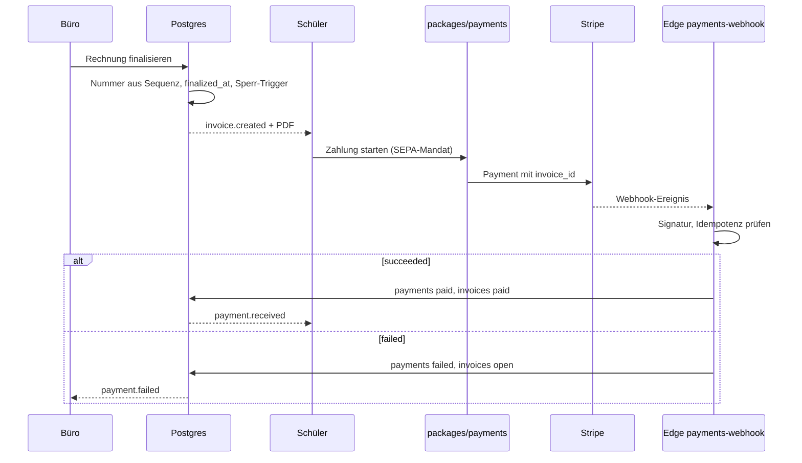
```mermaid
sequenceDiagram
    participant B as Büro
    participant DB as Postgres
    participant S as Schüler
    participant P as packages/payments
    participant ST as Stripe
    participant W as Edge payments-webhook
    B->>DB: Rechnung finalisieren
    DB->>DB: Nummer aus Sequenz, finalized_at, Sperr-Trigger
    DB-->>S: invoice.created + PDF
    S->>P: Zahlung starten (SEPA-Mandat)
    P->>ST: Payment mit invoice_id
    ST-->>W: Webhook-Ereignis
    W->>W: Signatur, Idempotenz prüfen
    alt succeeded
        W->>DB: payments paid, invoices paid
        DB-->>S: payment.received
    else failed
        W->>DB: payments failed, invoices open
        DB-->>B: payment.failed
    end
```

## Flow 16: Dokumenten-Checkliste und Upload

1. Bei Anmeldung wird die Checkliste aus document_checklist_templates der Klasse erzeugt (z. B. Sehtest, Erste-Hilfe-Nachweis, Passbild, Ausweiskopie; Pflichtdokumente je Klasse fachlich zu verifizieren, daher je Tenant konfigurierbar).
2. Schüler sieht offene Punkte mit Frist im Profil und im Heute-Modus. Er wählt einen Punkt und lädt Foto oder PDF hoch.
3. Client komprimiert das Bild, lädt es in Storage unter tenant_id/students/student_id/documents/ hoch (Storage-RLS: nur eigener Pfad, Büro des Tenants lesend); documents erhält Status uploaded.
4. Büro prüft im Bereich Dokumente: Status verified oder rejected mit Grund. Bei rejected erhält der Schüler document.reviewed mit Grund und kann erneut hochladen.
5. Prüfungsplanung (Flow 13) liest den Status aller Pflichtdokumente.
6. Dokumente mit Ablaufdatum (z. B. Sehtest, falls fachlich befristet) erhalten valid_until; bei Ablauf vor Prüfungstermin Hinweis.

Fehlerfälle: Datei zu groß oder falscher Typ (Ablehnung vor Upload); Upload unterbrochen (Wiederaufnahme, Datei bleibt lokal); Büro löscht versehentlich (Soft-Delete mit Wiederherstellung innerhalb 30 Tagen, Audit).

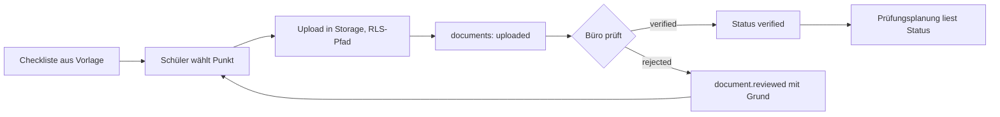
```mermaid
flowchart LR
    A[Checkliste aus Vorlage] --> B[Schüler wählt Punkt]
    B --> C[Upload in Storage, RLS-Pfad]
    C --> D[documents: uploaded]
    D --> E{Büro prüft}
    E -- verified --> F[Status verified]
    E -- rejected --> G[document.reviewed mit Grund] --> B
    F --> H[Prüfungsplanung liest Status]
```

## Flow 17: Chat zwischen Schüler und Fahrlehrer

1. Konversation wird automatisch angelegt, wenn ein Fahrlehrer einem Schüler zugewiesen wird (conversations mit Teilnehmern). Schüler-Büro-Konversation entsteht bei Anmeldung (A2).
2. Nutzer schreibt eine Nachricht. Client speichert messages mit client_message_id; Realtime verteilt an Teilnehmer (Kanal je Konversation, Zugriff über RLS auf conversation_participants).
3. Empfänger erhält message.received (push, inbox); Lesestatus wird beim Öffnen gesetzt.
4. Anhänge (Bilder) laufen über Storage mit RLS auf conversation_id.
5. Bei minderjährigen Schülern zeigt die Konversation beiden Parteien den Hinweis, dass das Büro bei Bedarf Einsicht nehmen kann; Einsicht wird im Audit-Log protokolliert.
6. Bei Ende der Zuweisung wird die Konversation archiviert (lesbar, nicht beschreibbar); Löschung nach Frist des Löschkonzepts.

Fehlerfälle: Senden offline (Queue, Status „nicht gesendet"); Duplikat durch Wiederholung (client_message_id); Meldung einer Nachricht (Büro erhält Prüfauftrag).

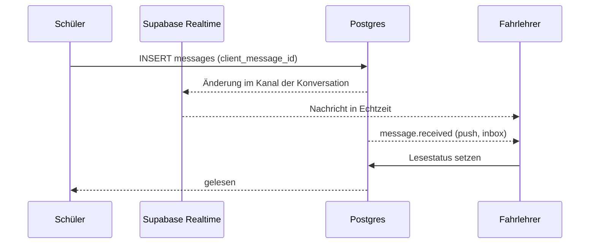
```mermaid
sequenceDiagram
    participant S as Schüler
    participant RT as Supabase Realtime
    participant DB as Postgres
    participant F as Fahrlehrer
    S->>DB: INSERT messages (client_message_id)
    DB-->>RT: Änderung im Kanal der Konversation
    RT-->>F: Nachricht in Echtzeit
    DB-->>F: message.received (push, inbox)
    F->>DB: Lesestatus setzen
    DB-->>S: gelesen
```

## Flow 18: Offline-Lernen und Sync-Konflikt

1. Beim Login lädt die App Lerninhalte der zugewiesenen Klasse (gültige question_versions, Medien in reduzierter Auflösung, Regelversion) in SQLite und speichert den Stand (content_snapshot_at).
2. Offline beantwortet der Schüler Fragen und führt Simulationen durch. Jeder Versuch erhält client_attempt_id (UUID) und wird in der Sync-Queue abgelegt.
3. Bei Verbindung sendet der Client die Queue in Batches an Edge sync. Der Server fügt student_question_attempts append-only ein; bereits vorhandene client_attempt_id werden ignoriert (Idempotenz). Simulationen werden mit der lokal gebundenen rule_version_id gespeichert, auch wenn inzwischen eine neuere Version gilt.
4. Server berechnet Mastery und Prüfungsreife neu (serverseitiges Merge, da alle Versuche additiv sind) und liefert den konsolidierten Stand zurück; Client ersetzt seinen lokalen Stand.
5. Profildaten (Tagesziel, Einstellungen) werden mit Versionsspalte synchronisiert: Client sendet version, Server akzeptiert nur bei Gleichheit (Last-Writer-Wins mit Erkennung); bei Abweichung gewinnt der neuere Server-Wert und der Client zeigt einen Hinweis.
6. Nach Sync prüft der Client, ob neue Inhaltsversionen vorliegen, und lädt sie im Hintergrund; laufende Sitzungen behalten die alte Version.

Fehlerfälle: Queue-Batch teilweise fehlgeschlagen (Server bestätigt je Eintrag, nur unbestätigte werden erneut gesendet); Gerät wechselt (Queue ist gerätegebunden, nicht synchronisierte Versuche gehen bei Deinstallation verloren, Hinweis vor Logout); Zeitverschiebung am Gerät (Server verwendet Empfangszeit als Ordnungskriterium, Gerätezeit nur informativ).

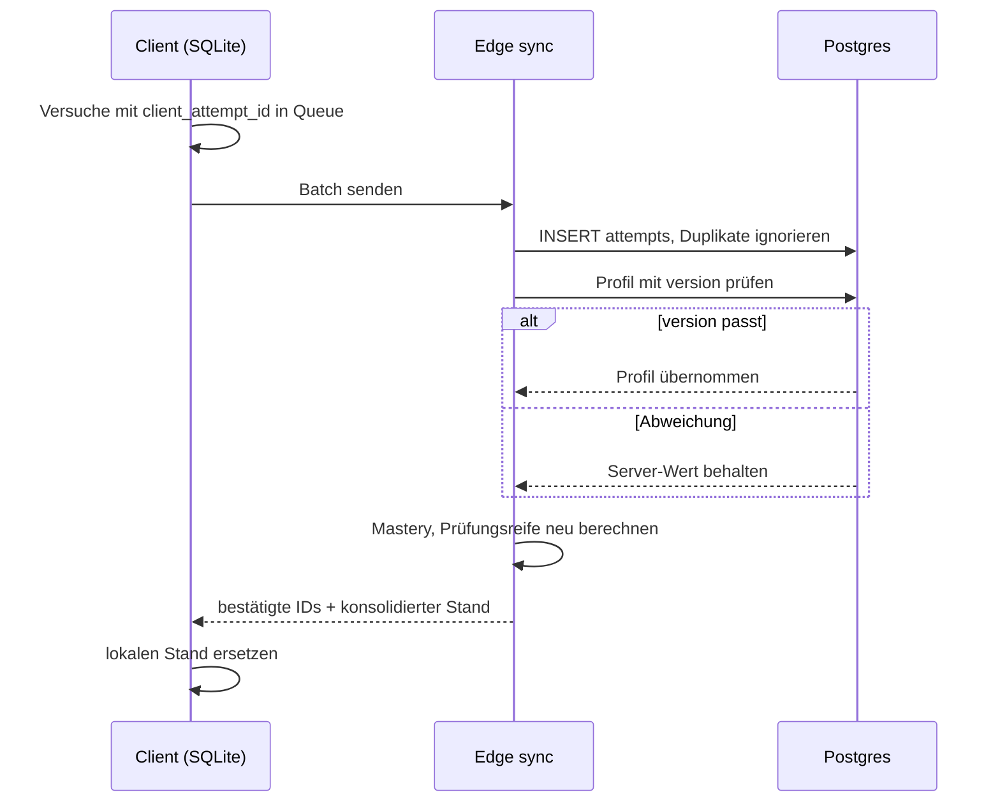
```mermaid
sequenceDiagram
    participant C as Client (SQLite)
    participant E as Edge sync
    participant DB as Postgres
    C->>C: Versuche mit client_attempt_id in Queue
    C->>E: Batch senden
    E->>DB: INSERT attempts, Duplikate ignorieren
    E->>DB: Profil mit version prüfen
    alt version passt
        DB-->>E: Profil übernommen
    else Abweichung
        DB-->>E: Server-Wert behalten
    end
    E->>E: Mastery, Prüfungsreife neu berechnen
    E-->>C: bestätigte IDs + konsolidierter Stand
    C->>C: lokalen Stand ersetzen
```

## Flow 19: Datenexport und Löschung (DSGVO)

1. Schüler wählt im Profil „Daten exportieren" oder „Konto löschen". System legt data_requests mit Typ, Zeitpunkt und Status an; Bestätigung per E-Mail-Link (Schutz vor Fehlbedienung).
2. Export: Edge data-export sammelt alle personenbezogenen Daten des Schülers (Stammdaten, Einwilligungen, Lernversuche aggregiert und roh, Termine, Bewertungen, Nachrichten, Rechnungen, Dokumente) als JSON und PDF-Zusammenfassung, legt sie verschlüsselt in Storage ab und sendet einen zeitlich begrenzten Link (7 Tage).
3. Löschung: Büro erhält Prüfauftrag (Vertragsstatus, offene Forderungen). Nach Freigabe oder automatisch nach 30 Tagen ohne Widerspruch führt Edge data-delete aus: Personendaten in students, users, messages werden gelöscht oder pseudonymisiert; Rechnungen bleiben mit pseudonymisiertem Empfänger für die Aufbewahrungsfrist (allgemein bekannt zehn Jahre, fachlich zu verifizieren); Audit-Logs bleiben mit pseudonymisierter Referenz; Lernversuche werden gelöscht; Ausbildungsnachweis bleibt für die gesetzliche Frist beim Tenant.
4. System dokumentiert die Löschung in data_requests und audit_logs und bestätigt per E-Mail an die vorher hinterlegte Adresse.
5. Fahrschulwechsel: Schüler kann zusätzlich „Ausbildungsstand exportieren" wählen; System erzeugt training_certificates mit Hash, das die Zielfahrschule als extern bescheinigt importieren kann.

Fehlerfälle: Offene Forderungen (Löschung wird verzögert, Schüler informiert); Minderjähriger (Guardian muss bestätigen); Export zu groß (Aufteilung in mehrere Archive).

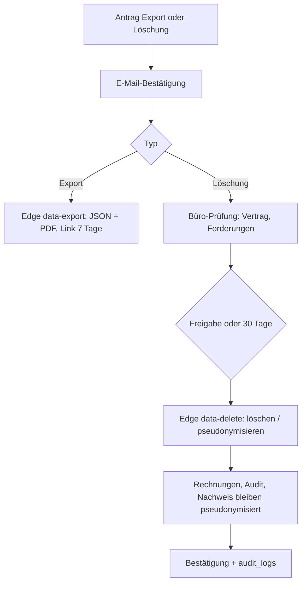
```mermaid
flowchart TD
    A[Antrag Export oder Löschung] --> B[E-Mail-Bestätigung]
    B --> C{Typ}
    C -- Export --> D[Edge data-export: JSON + PDF, Link 7 Tage]
    C -- Löschung --> E[Büro-Prüfung: Vertrag, Forderungen]
    E --> F{Freigabe oder 30 Tage}
    F --> G[Edge data-delete: löschen / pseudonymisieren]
    G --> H[Rechnungen, Audit, Nachweis bleiben pseudonymisiert]
    H --> I[Bestätigung + audit_logs]
```

## Flow 20: Content-Freigabe-Workflow im CMS

Status: draft, in_review, approved, published, superseded, withdrawn.

1. Autor (platform_admin für globale Inhalte, Tenant-admin für eigene Übungsfragen) legt einen Entwurf an: Inhalt, Quelle (Pflicht), Medien mit Lizenznachweis, Alternativtext, Zielklassen, Grund-/Zusatzstoff, Fehlerpunkte, Themenverknüpfung.
2. Autor setzt in_review. System sendet content.review_requested an Reviewer.
3. Reviewer (nicht der Autor, technisch erzwungen) prüft fachlich, ergänzt reviewed_by, Kommentar; setzt approved oder zurück auf draft mit Begründung.
4. Freigabe zur Veröffentlichung: Autor oder Reviewer setzt published mit valid_from (frühestens heute). System erzeugt eine neue question_version mit version, valid_from, valid_until NULL, last_updated; die Vorgängerversion erhält valid_until gleich valid_from der neuen minus einen Tag und Status superseded.
5. Clients laden bei nächstem Sync die neue Version; laufende Sitzungen behalten die alte. Historische Versuche referenzieren weiterhin ihre question_version_id.
6. Rückzug (withdrawn): Bei fachlichem Fehler wird die Version mit sofortigem valid_until zurückgezogen; betroffene Versuche werden in der Auswertung als „Frage zurückgezogen" gekennzeichnet, nicht als Fehler gewertet.

Fehlerfälle: Reviewer gleich Autor (Ablehnung durch RLS-Policy); fehlende Quelle oder Lizenz (Freigabe technisch blockiert); Veröffentlichung mit valid_from in der Vergangenheit (nicht erlaubt, keine rückwirkende Änderung).

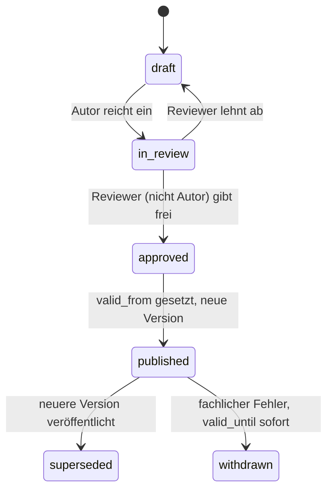
```mermaid
stateDiagram-v2
    [*] --> draft
    draft --> in_review: Autor reicht ein
    in_review --> draft: Reviewer lehnt ab
    in_review --> approved: Reviewer (nicht Autor) gibt frei
    approved --> published: valid_from gesetzt, neue Version
    published --> superseded: neuere Version veröffentlicht
    published --> withdrawn: fachlicher Fehler, valid_until sofort
```

## Flow 21: Regelversion-Update ohne Rückwirkung

1. Plattform-Admin legt in „Regelversionen" eine neue rule_version an: rule_type (z. B. theory_exam, special_drives, theory_lessons, exam_retry_waiting_period, exam_languages), license_class, acquisition_type, payload JSON, source, valid_from (in der Zukunft oder heute), review_status draft.
2. System zeigt einen Vergleich mit der aktuell gültigen Version (Feld für Feld) und die Anzahl betroffener Tenants und Schüler in Ausbildung.
3. Zweiter Plattform-Admin prüft fachlich und setzt approved; Quelle und Rechtsstand sind Pflicht. Werte außerhalb allgemein bekannter Klassen tragen den Vermerk „fachlich verifiziert am Datum durch Reviewer".
4. Veröffentlichung setzt published und valid_until der Vorgängerversion auf den Tag vor valid_from. Beide Versionen bleiben unverändert gespeichert; freigegebene Versionen sind per Trigger unveränderlich.
5. rules-engine wählt zur Laufzeit die Version, deren Gültigkeitszeitraum das Bezugsdatum enthält: Für neue Simulationen das heutige Datum, für die Anzeige historischer Ergebnisse die gespeicherte rule_version_id, für den Ausbildungsstand eines Schülers die Version, die am Datum des Vertragsbeginns galt, sofern die Regel Übergangsvorschriften vorsieht (konfigurierbar je rule_type, Standard: aktuelle Version mit Hinweis auf Änderung).
6. Tenant-Admins und Owner erhalten rule.version_published mit Zusammenfassung; Schüler sehen den neuen Rechtsstand in der Lernübersicht.
7. Bereits gespeicherte exam_results werden nie neu berechnet. Wer ein altes Ergebnis öffnet, sieht die damals gültige Regelversion mit Hinweis „Regel seit Datum geändert".

Fehlerfälle: Überlappende Gültigkeitszeiträume (Constraint verhindert); valid_from in der Vergangenheit (nicht erlaubt); Rücknahme einer fehlerhaften Version (neue Korrekturversion mit valid_from heute, keine Löschung; betroffene Ergebnisse werden mit Hinweis markiert, nicht verändert).

```mermaid
flowchart TD
    A[Neue rule_version: draft] --> B[Vergleich mit aktueller Version]
    B --> C[Reviewer: approved, Quelle, Rechtsstand]
    C --> D[published, Vorgänger valid_until setzen]
    D --> E{Bezugsdatum}
    E -- heute --> F[Neue Simulationen nutzen neue Version]
    E -- gespeicherte rule_version_id --> G[Alte Ergebnisse unverändert]
    D --> H[rule.version_published an Tenants]
```

## Anhang: Übergreifende Fehlerbehandlung

1. Jede schreibende Aktion aus Mobile trägt einen Idempotenzschlüssel; der Server antwortet bei Wiederholung mit dem ursprünglichen Ergebnis.
2. Konflikte aus Datenbank-Constraints (Exclusion, Unique, Check) werden als 409 mit strukturiertem Fehlercode an den Client gegeben und dort in verständliche Meldungen übersetzt (packages/i18n, Namensraum errors.*).
3. Alle Edge Functions protokollieren Fehler ohne Personendaten; Korrelation über request_id.
4. Nutzer sehen nie einen Rohfehler; jede Meldung enthält die nächste mögliche Aktion.
5. Audit-relevante Aktionen (Stornierung, Anwesenheitskorrektur, Rechnungsstorno, Löschung, Supportzugriff, Regelfreigabe) sind ohne Begründung nicht ausführbar.
