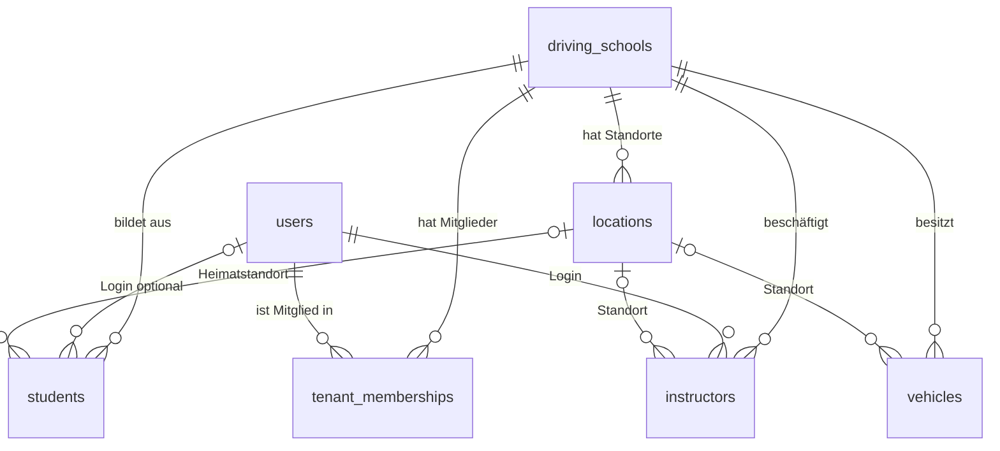
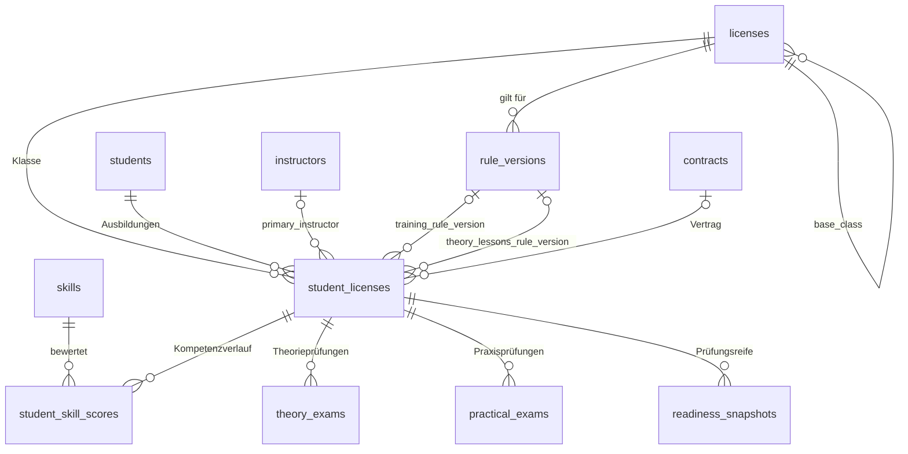
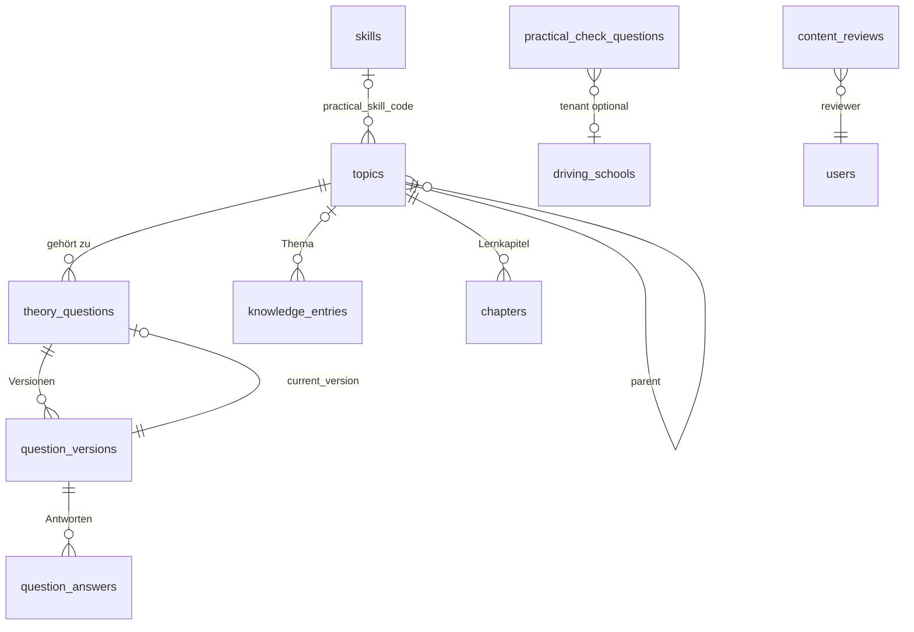
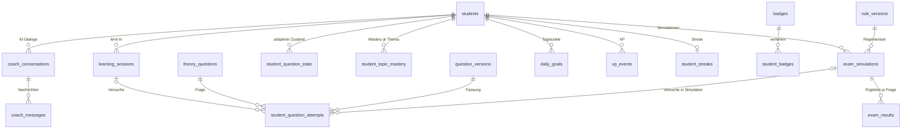
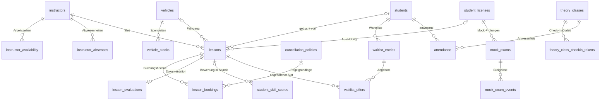
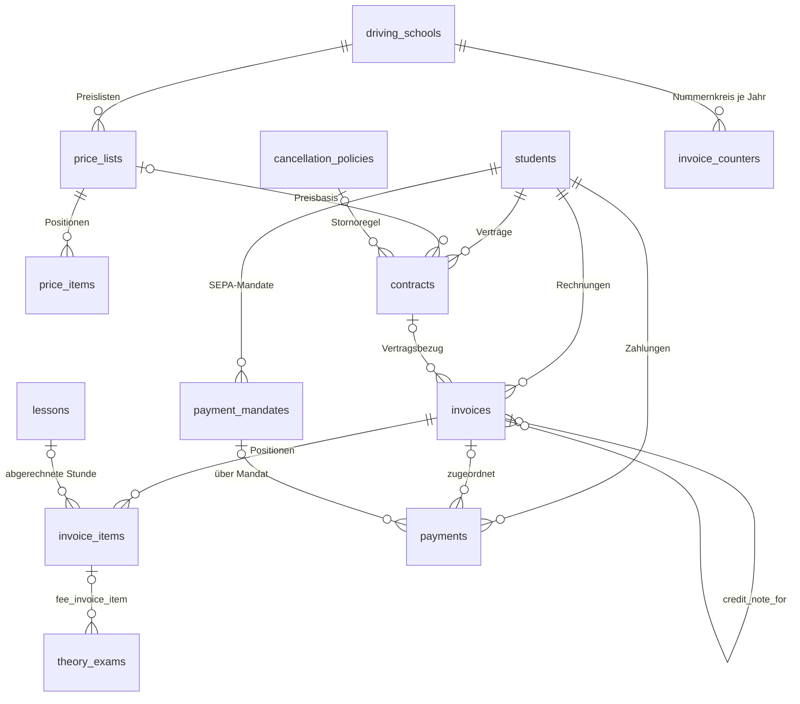
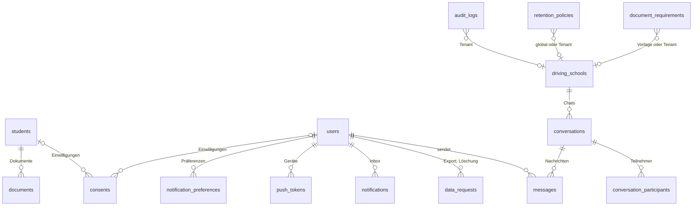

# FahrPilot: Datenmodell

Stand: September 2026. Dieses Dokument beschreibt das verbindliche Datenbankschema aus supabase/migrations/0001 bis 0010. Es erklärt die Grundprinzipien, zeigt die Entitäten je Domäne als ER-Diagramm, listet jede Tabelle mit Zweck, Schlüsselspalten, Constraints und RLS-Zusammenfassung und dokumentiert die JWT-Claims, die Regel-Engine und die serverseitigen Funktionen. Werte in Regel-Payloads, die noch nicht fachlich geprüft sind, tragen in der Datenbank den Status needs_verification und werden hier nicht als gesichert dargestellt.

## 1. Grundprinzipien

1. Tenant-Isolation über tenant_id, JWT-Claims und RLS: Jede mandantenbezogene Tabelle trägt tenant_id mit Fremdschlüssel auf driving_schools. Der Supabase Custom Access Token Hook schreibt tenant_id, tenant_role und platform_admin in app_metadata des JWT. Die Helferfunktionen app.current_tenant_id(), app.current_role(), app.is_staff(), app.is_office(), app.is_admin() und app.is_platform_admin() lesen diese Claims. Alle Tabellen in public haben RLS aktiviert und erzwungen (force row level security), auch für den Tabelleneigentümer. Der Trigger app.enforce_tenant_on_write() verhindert zusätzlich auf Datenbankebene, dass eine Zeile mit fremder tenant_id geschrieben wird, selbst wenn eine Policy fehlerhaft wäre.
2. Globale Inhalte mit tenant_id NULL: Themen, Fragen, Wissensbasis, Kapitel, Prüfer-Fragen, Dokumentenanforderungen und Aufbewahrungsregeln existieren global (tenant_id NULL, gepflegt vom Plattform-Admin) oder tenant-eigen (tenant_id gesetzt, gepflegt vom Tenant-Admin). Lesbar sind globale Inhalte nur im Status published, tenant-eigene im eigenen Tenant.
3. Versionierung: Fragen (question_versions), Regeln (rule_versions), Wissensbasis und Kapitel (Spalte version, valid_from, valid_until) sind versioniert. Ergebnisse referenzieren immer die konkrete Version (question_version_id, rule_version_id), nie nur die stabile Identität.
4. Append-only-Tabellen: student_question_attempts, xp_events, student_badges, lesson_bookings, student_skill_scores, content_reviews, consents (Widerruf durch revoked_at, nicht durch Löschen), mock_exam_events und audit_logs erhalten keine Update- oder Delete-Policy für authenticated. Der aktuelle Zustand wird daraus abgeleitet oder in verdichteten Tabellen (student_question_state, student_topic_mastery) gehalten.
5. Idempotenzschlüssel für Offline-Sync: Der Client erzeugt UUIDs (client_session_id, client_attempt_id, client_event_id, client_request_id, client_message_id). Unique-Constraints auf (student_id, client_*) beziehungsweise (lesson_id, client_request_id) sorgen dafür, dass eine wiederholt gesendete Operation genau einmal wirkt.
6. Exclusion-Constraints für Terminüberschneidungen: lessons verhindert per btree_gist, dass ein Fahrlehrer, ein Fahrzeug oder ein Schüler im selben Zeitraum doppelt verplant wird (Ausnahme: status cancelled). instructor_absences und vehicle_blocks verhindern überlappende Sperrzeiten. rule_versions verhindert überlappende veröffentlichte Gültigkeitsbereiche desselben Regelschlüssels.
7. Audit-Trigger: 26 sicherheits- oder nachweisrelevante Tabellen schreiben per Trigger app.audit_row_change() in audit_logs (Aktor, Rolle, alte und neue Daten ohne notes_internal und ai_transcript, geänderte Spalten, Request-ID). Die Rolle authenticated kann audit_logs nur lesen (Admins des Tenants), nie schreiben oder löschen.
8. Lückenlose Rechnungsnummern: invoice_counters führt je Tenant und Jahr einen Zähler. app.next_invoice_number() erhöht ihn unter Zeilensperre und bildet Präfix-Jahr-Laufnummer (z. B. RE-2026-00001). authenticated hat keinerlei Rechte auf invoice_counters.
9. Unveränderliche ausgestellte Rechnungen: Der Trigger app.protect_issued_invoice() lehnt nach dem Status draft jede Änderung an Nummer, Beträgen, Schüler und Ausstellungsdatum ab. Korrekturen laufen über Storno oder Gutschrift (credit_note_for). Positionen sind nur im Status draft änderbar.
10. Optimistic Locking: Stammdaten mit Bearbeitung durch mehrere Parteien (students, student_licenses, lessons, lesson_evaluations, student_question_state) tragen row_version, die per Trigger bei jedem Update erhöht wird. Der Client sendet die gelesene Version mit; bei Abweichung gewinnt der Server und der Client zeigt einen Hinweis.
11. Datensparsamkeit im Schema: Zahlungsdaten liegen beim Zahlungsanbieter (nur masked_iban und Provider-IDs), Check-in-Codes werden nur als SHA-256-Hash gespeichert, Geofence-Ergebnisse als Distanz in Metern ohne Koordinaten, Einwilligungen mit IP-Hash statt IP.

## 2. ER-Diagramme je Domäne

### 2.1 Tenancy und Nutzer

### 2.2 Ausbildung, Klassen und Regeln

### 2.3 Inhalte

### 2.4 Lernen

### 2.5 Termine und Fahrstunden

### 2.6 Finanzen

### 2.7 Dokumente, Kommunikation und DSGVO

## 3. Tabellen je Entity

Spalten: Zweck, Schlüsselspalten, wichtige Constraints und Indizes, RLS lesen, RLS schreiben. Rollenkürzel: S = student, I = instructor, O = office, A = admin, W = owner, P = platform_admin, SR = service_role (nur serverseitig, umgeht RLS). „Staff" = I, O, A, W. „Office" = O, A, W. „Admin" = A, W. „eigen" bedeutet: Zeile gehört zum angemeldeten Schüler (app.current_student_id()) beziehungsweise Fahrlehrer (app.current_instructor_id()).

### 3.1 Tenancy und Nutzer (0002)

| Tabelle | Zweck | Schlüsselspalten | Constraints und Indizes | RLS lesen | RLS schreiben |
|---|---|---|---|---|---|
| driving_schools | Mandant (Fahrschule) mit Stammdaten, Zeitzone, Locale, Rechnungspräfix, settings (z. B. auto_confirm_bookings) | id, slug (citext unique), status | status in trial, active, suspended, closed; updated_at-Trigger; Audit | eigener Tenant oder P | Update Admin; Insert nur SR (Tenant-Onboarding) |
| locations | Standorte je Fahrschule mit Öffnungszeiten und Koordinaten | id, tenant_id, is_primary | Index tenant_id; Tenant-Trigger; Audit | alle im Tenant | Admin |
| users | Profil 1:1 zu auth.users, Locale, Barrierefreiheit, Plattform-Admin-Flag | id (= auth.users.id), email citext | updated_at-Trigger | self; Mitglieder desselben Tenants, wenn Leser Staff ist oder Ziel kein Schüler ist | Insert/Update nur self; is_platform_admin nicht selbst änderbar |
| tenant_memberships | Mitgliedschaft Nutzer in Tenant mit genau einer Rolle; Quelle für Auth-Hook | id, tenant_id, user_id, role, status | unique (tenant_id, user_id); Index user_id; Audit | eigene Mitgliedschaften; Staff sieht alle im Tenant | Admin |
| students | Schülerakte (auch ohne Login, status lead); Guardian-Kontakt; row_version | id, tenant_id, user_id, student_number, status | unique (tenant_id, student_number), unique (tenant_id, user_id); Indizes status und Name; bump_row_version; Audit | Staff oder eigene Zeile (user_id = auth.uid()) | Office |
| instructors | Fahrlehrer mit Fahrlehrerlaubnis je Klasse, Theorie-/Getriebe-Flags, Kalenderfarbe | id, tenant_id, user_id, license_classes | unique (tenant_id, user_id); Partial-Index active; Audit | alle im Tenant | Admin |
| vehicles | Fuhrpark mit Getriebe, Klassen, HU, Wartung, Reifen, Versicherung | id, tenant_id, license_plate, transmission, status | unique (tenant_id, license_plate); Audit | alle im Tenant | Office |

### 3.2 Klassen, Regeln, Ausbildungen (0003)

| Tabelle | Zweck | Schlüsselspalten | Constraints und Indizes | RLS lesen | RLS schreiben |
|---|---|---|---|---|---|
| licenses | Fahrerlaubnisklassen (B, B197, B78, B96, BE, AM, A1, A2, A, C1, C1E, C, CE, D1, D1E, D, DE) mit base_class, Mindestalter, Prüfungspflichten | code (PK), base_class | Selbstreferenz base_class | alle | P |
| rule_versions | Versionierte Regeln je rule_type (exam_theory, exam_practical, training_requirements, theory_lessons), Klasse, acquisition_kind, Gültigkeit, Payload, Quelle, Rechtsstand, review_status | id, rule_type, license_code, acquisition_kind, version, valid_from, valid_until, review_status | unique (rule_type, license_code, acquisition_kind, version); Exclusion gegen überlappende published-Bereiche; Lookup-Index; Audit | published für alle; alle Stati für P | P |
| student_licenses | Eine Ausbildung = Schüler + Klasse (Mehrfachausbildung möglich), Ersterwerb/Erweiterung, Getriebe, BF17, Prüfungsstatus, gepinnte Regelversionen, row_version | id, tenant_id, student_id, license_code, acquisition_kind, status | unique (student_id, license_code); FK contract_id (0007); bump_row_version; Audit | Staff oder eigen | Office |

### 3.3 Inhalte (0004)

| Tabelle | Zweck | Schlüsselspalten | Constraints und Indizes | RLS lesen | RLS schreiben |
|---|---|---|---|---|---|
| topics | Themenbaum (global oder Tenant), Grund-/Zusatzstoff, Kopplung zu skills über practical_skill_code | id, tenant_id (NULL = global), code, parent_id | unique code global; unique (tenant_id, code) je Tenant | global und eigener Tenant | P für global, Admin für Tenant |
| theory_questions | Stabile Frage-Identität, Quelle (own, official_licensed, tenant), Punkte, Schwierigkeit, Fragetyp, Status | id, tenant_id, topic_id, source, status, current_version_id | FK current_version_id deferrable; Indizes topic (published), source, GIN license_codes; Audit | published (global oder Tenant); Entwürfe nur P bzw. Tenant-Admin | P (global), Admin (Tenant) |
| question_versions | Inhalt einer Frage je Version und Locale: Text, Medien, Erklärung, Merksatz, Rechtsgrundlage, Gültigkeit, review_status | id, question_id, version, locale | unique (question_id, version, locale); Index (question_id, locale, version); Audit | wenn Frage sichtbar | wie Frage |
| question_answers | Antwortoptionen je Frageversion mit Korrektheit und Erklärung | id, question_version_id, position | unique (question_version_id, position); position 1 bis 6 | wenn Version sichtbar | wie Frage |
| knowledge_entries | Geprüfte Wissensbasis für den KI-Coach mit Quelle, Rechtsstand, Volltext-Suchvektor (german) | id, tenant_id, slug, locale, version, review_status | unique (slug, locale, version); GIN search_vector; Audit | published (global oder Tenant); Entwürfe P bzw. Admin | P (global), Admin (Tenant) |
| chapters | Lernkapitel (Lesestoff) je Thema, Locale und Klasse | id, tenant_id, topic_id, locale, version | Index (topic_id, locale) published | wie knowledge_entries | wie knowledge_entries |
| practical_check_questions | Prüfer-Fragen (Sicherheitskontrollen, Fahrzeugtechnik) mit erwarteten Stichpunkten | id, tenant_id, category, locale | category-Check | wie knowledge_entries | wie knowledge_entries |
| content_reviews | Änderungsverlauf des Freigabe-Workflows über alle Inhaltstabellen | id, entity_table, entity_id, from_status, to_status | Index (entity_table, entity_id, created_at) | P oder Admin | Insert P oder Admin; kein Update/Delete |

### 3.4 Lernen (0005)

| Tabelle | Zweck | Schlüsselspalten | Constraints und Indizes | RLS lesen | RLS schreiben |
|---|---|---|---|---|---|
| learning_sessions | Lernsitzung je Modus (12 Lernmodi in app.learning_mode) mit Zählern | id, tenant_id, student_id, mode, client_session_id | unique (student_id, client_session_id); Index (student_id, started_at) | Staff oder eigen | Insert/Update eigen |
| student_question_attempts | Append-only Versuch: gewählte Antworten, Korrektheit, Sicherheit (1 bis 3), Antwortzeit | id, student_id, question_id, question_version_id, client_attempt_id | unique (student_id, client_attempt_id); Indizes (student_id, answered_at) und (student_id, question_id) | Staff oder eigen | Insert eigen; kein Update |
| student_question_state | Verdichteter adaptiver Zustand je Schüler und Frage (SM-2-Felder ease, interval_days, due_at, mastery, bookmarked), row_version | PK (student_id, question_id) | Indizes due_at und mastery; bump_row_version | Staff oder eigen | Insert/Update eigen |
| student_topic_mastery | Mastery, Coverage und Fehleranteil je Thema (Snapshot für Dashboard) | PK (student_id, topic_id) | Tenant-Trigger | Staff oder eigen | Insert/Update eigen |
| exam_simulations | Prüfungssimulation mit rule_version_id und rule_snapshot, Fragen-IDs, Ergebnis, Fehlerpunkte, Analyse | id, student_id, license_code, rule_version_id, client_session_id, status | unique (student_id, client_session_id); Index (student_id, started_at) | Staff oder eigen | Insert/Update eigen |
| exam_results | Ergebnis je Frage einer Simulation | id, exam_simulation_id, position | unique (exam_simulation_id, position) | wenn Simulation sichtbar | Insert eigen; Update nur solange Simulation in_progress |
| readiness_snapshots | Prüfungsreife 0 bis 100 (Theorie, Praxis, Gesamt) mit transparenten Faktoren und engine_version | id, student_license_id, computed_at | Score-Checks 0 bis 100; Index (student_license_id, computed_at) | Staff oder eigen | nur SR (Berechnung serverseitig) |
| daily_goals | Tagesziel (Fragen, Minuten) und Erreichung | PK (student_id, goal_date) | Tenant-Trigger | Staff oder eigen | Insert/Update eigen |
| xp_events | Append-only XP-Ereignisse mit client_event_id | id, student_id, kind, client_event_id | unique (student_id, client_event_id) | Staff oder eigen | Insert eigen |
| badges | Abzeichenkatalog mit Kriterien (global) | code (PK) | keine | alle | P |
| student_badges | Verliehene Abzeichen | PK (student_id, badge_code) | Tenant-Trigger | Staff oder eigen | Insert eigen |
| student_streaks | Streak, XP-Summe, Level je Schüler | student_id (PK) | Tenant-Trigger | Staff oder eigen | Insert/Update eigen |
| coach_conversations | KI-Coach-Dialog mit Kontext (Frage, Thema, Praxis, Foto, frei) | id, student_id, context_kind, context_ref | Index (student_id, created_at) | Staff oder eigen | Insert eigen |
| coach_messages | Nachrichten mit Quellen, Confidence (verified, partial, uncertain), Modell und Tokenzahlen | id, conversation_id, role | Index (conversation_id, created_at) | wenn Dialog sichtbar | Insert nur role user durch Schüler; assistant nur SR |

### 3.5 Ausbildung und Termine (0006)

| Tabelle | Zweck | Schlüsselspalten | Constraints und Indizes | RLS lesen | RLS schreiben |
|---|---|---|---|---|---|
| skills | Fahrkompetenzen (19 Codes, Kategorien basic_tasks, traffic, special_drives, eco, independent) | code (PK) | keine | alle | P |
| student_skill_scores | Append-only Bewertungsverlauf je Ausbildung und Kompetenz (1 bis 5 Sterne) | id, student_license_id, skill_code, lesson_id, instructor_id | Index (student_license_id, skill_code, rated_at); FK lesson_id; Audit | Staff oder eigen | Insert Staff, wenn instructor_id eigen oder Office; kein Update |
| instructor_availability | Wöchentliche Arbeitszeiten und Pausen (kind work/break) mit Gültigkeit | id, instructor_id, weekday, start_time, end_time, kind | end_time > start_time; Index (instructor_id, weekday) | alle im Tenant | Office oder eigener Fahrlehrer |
| instructor_absences | Abwesenheiten als tstzrange (Urlaub, krank, Fortbildung) | id, instructor_id, period | Exclusion (instructor_id, period) | Staff | Office oder eigener Fahrlehrer |
| vehicle_blocks | Fahrzeug-Sperrzeiten als tstzrange | id, vehicle_id, period | Exclusion (vehicle_id, period) | Staff | Office |
| lessons | Fahrstunde oder freier Slot (student_id NULL = buchbar); Art (9 Arten), Status (6 Stati), Einheiten 1 bis 4, Preis, row_version | id, tenant_id, instructor_id, vehicle_id, student_id, student_license_id, kind, status, period, units | Exclusion je Fahrlehrer, Fahrzeug, Schüler (nicht cancelled); booked erfordert student_id; GiST (tenant_id, period); Indizes Fahrlehrer, Schüler, offene Slots; bump_row_version; Audit | Staff; Schüler sieht offene Slots und eigene Stunden | Office oder eigener Fahrlehrer; Schüler nur über RPC |
| cancellation_policies | Stornoregeln je Tenant mit Gültigkeit, Frist, Gebühr prozentual oder fix, Vertragsklausel | id, tenant_id, valid_from | Index (tenant_id, valid_from); Audit | alle im Tenant | Admin |
| lesson_bookings | Buchungshistorie (requested, confirmed, rejected, cancelled_by_student, cancelled_by_school, rescheduled, no_show) mit Gebühr und Regelgrundlage | id, lesson_id, student_id, action, client_request_id | unique (lesson_id, client_request_id); Indizes lesson und student; Audit | Staff oder eigen | Insert Staff; Schüler nur über RPC; kein Update/Delete |
| waitlist_entries | Wartelistenwunsch (Zeitraum, Wochentage, Zeitfenster, Fahrlehrer, Getriebe, Strategie) | id, student_id, earliest, latest, status | latest > earliest; Index (tenant_id, status) | Staff oder eigen | Insert/Update eigen |
| waitlist_offers | Angebot eines frei gewordenen Slots mit Ablauf und Antwort | id, waitlist_entry_id, lesson_id, expires_at | unique (waitlist_entry_id, lesson_id) | Staff oder eigen | Staff; Schüler darf eigene Angebote beantworten (Update) |
| lesson_evaluations | Dokumentation nach der Stunde: Inhalte, Kommentar, Ziele, Gesamtbewertung, KI-Entwurf mit Bestätigung, Sichtbarkeit, row_version | id, lesson_id (unique), student_license_id, instructor_id | Index (student_license_id, created_at); bump_row_version; Audit | Staff; Schüler nur wenn shared_with_student und eigen | Office oder eigener Fahrlehrer |
| theory_classes | Theorieunterrichtseinheit (Lektionscode, Grund-/Zusatzstoff, Zeitraum, Kapazität, online) | id, tenant_id, lesson_unit_code, period, status | upper > lower; Index (tenant_id, lower(period)) | alle im Tenant | Staff |
| theory_class_checkin_tokens | Rotierende Check-in-Codes als Hash mit Gültigkeitsfenster und Nutzungszähler | id, theory_class_id, token_hash (unique) | Index (theory_class_id, valid_until); kein Delete-Grant für authenticated | Staff | Insert/Update Staff (praktisch über RPC) |
| attendance | Anwesenheit je Unterricht und Schüler mit Check-in-Methode, Gerätefingerabdruck, Geo-Distanz | id, theory_class_id, student_id, status | unique (theory_class_id, student_id); Index student; Audit | Staff oder eigen | Staff; Schüler nur über RPC |
| mock_exams | Simulierte praktische Prüfung durch Fahrlehrer | id, student_license_id, instructor_id, status | Index (student_license_id, started_at) | Staff oder eigen | Office oder eigener Fahrlehrer |
| mock_exam_events | Ereignisse während der Mock-Prüfung (Kompetenz, Polarität, Schwere) | id, mock_exam_id, occurred_at | Index (mock_exam_id, occurred_at) | wenn Mock-Prüfung sichtbar | Office oder Fahrlehrer der Mock-Prüfung |
| theory_exams | Offizielle Theorieprüfung mit Statusworkflow (app.exam_status), Prüforganisation, Sprache, Versuch, Ergebnis, Regelversion | id, student_license_id, status, attempt_no | Index (student_license_id, attempt_no); FK fee_invoice_item_id (0007); Audit | Staff oder eigen | Staff |
| practical_exams | Offizielle praktische Prüfung mit Fahrlehrer, Fahrzeug, Treffpunkt, Ergebnis, Regelversion | id, student_license_id, status, attempt_no | Index (student_license_id, attempt_no); Audit | Staff oder eigen | Staff |

### 3.6 Finanzen (0007)

| Tabelle | Zweck | Schlüsselspalten | Constraints und Indizes | RLS lesen | RLS schreiben |
|---|---|---|---|---|---|
| price_lists | Versionierte Preisliste je Tenant und optional Klasse mit Steuersatz | id, tenant_id, license_code, valid_from | Index (tenant_id, valid_from) | alle im Tenant | Admin |
| price_items | Positionen (Code, Einheit each/unit45/hour, Betrag, lesson_kind) | id, price_list_id, code | unique (price_list_id, code) | wenn Preisliste sichtbar | Admin |
| contracts | Ausbildungsvertrag mit Preisliste, Stornoregel, Status, Signaturverfahren und Signaturnachweis | id, student_id, status, signature_method | Index student; Audit | Office oder eigen | Office |
| invoice_counters | Zähler je Tenant und Jahr für lückenlose Nummern | PK (tenant_id, year) | keine Rechte für authenticated | nur SR | nur SR über app.next_invoice_number() |
| invoices | Rechnung mit Nummer, Status (app.invoice_status), Beträgen, Mahnstufe, PDF, E-Rechnungspfad, Gutschriftbezug | id, tenant_id, student_id, invoice_number, status | unique (tenant_id, invoice_number); Nummer Pflicht außerhalb draft; protect_issued_invoice; Indizes student und status; Audit | Office oder eigen | Office; Kernfelder nach Ausstellung gesperrt |
| invoice_items | Positionen mit Menge, Nettobetrag, Steuersatz, Stundenbezug | id, invoice_id, position | unique (invoice_id, position); Audit | wenn Rechnung sichtbar | Office, nur solange Rechnung draft |
| payment_mandates | SEPA- oder Kartenmandate mit Provider-Referenz und maskierter IBAN | id, student_id, provider, method, status | Index student; Audit | Office oder eigen | Office |
| payments | Zahlungen und Erstattungen (negativ), Provider-ID, webhook_event_id für Idempotenz | id, student_id, invoice_id, amount_cents, status, webhook_event_id (unique) | amount_cents <> 0; Trigger apply_payment_to_invoice; Indizes invoice und student; Audit | Office oder eigen | Office; Webhooks über SR |

### 3.7 Dokumente, Kommunikation, DSGVO (0007)

| Tabelle | Zweck | Schlüsselspalten | Constraints und Indizes | RLS lesen | RLS schreiben |
|---|---|---|---|---|---|
| document_requirements | Checklistenvorlagen (global) oder Tenant-Konfiguration mit applies_when-Bedingungen | id, tenant_id, code | unique code global; unique (tenant_id, code) | global und eigener Tenant | P (global), Admin (Tenant) |
| documents | Dokumente je Schüler mit Storage-Pfad, Status, Prüfung, Ablauf, retention_until | id, student_id, requirement_code, kind, status | unique (student_id, requirement_code); Index (student_id, kind); Audit | Office oder eigen | Insert Office oder eigen; Update Office, Schüler nur in missing/rejected/uploaded; Delete Office |
| consents | Einwilligungen mit Textversion, Gewährung, Widerruf, IP-Hash, Nachweis | id, user_id, student_id, consent_type, text_version | Indizes user und student; Audit | eigene oder Office | Insert eigen oder Office; Update eigen (Widerruf) |
| notification_preferences | Kanäle und Ruhezeiten je Nutzer und Typ | PK (user_id, notification_type) | keine | eigen | eigen |
| push_tokens | Geräte-Tokens (expo, fcm, apns, webpush) | id, user_id, provider, token | unique (provider, token) | eigen | eigen |
| notifications | In-App-Inbox mit Kanälen, Planungszeit, Versand- und Lesezeit, dedupe_key | id, user_id, notification_type, dedupe_key | unique (user_id, dedupe_key); Partial-Indizes ungelesen und fällig | eigen | Update eigen (read_at); Insert nur SR und RPC |
| conversations | Chat-Konversation (student_instructor, student_office, staff) | id, tenant_id, kind, student_id | Index (tenant_id, last_message_at) | Office oder Teilnehmer | alle im Tenant (Anlage) |
| conversation_participants | Teilnehmer mit Lesestand | PK (conversation_id, user_id) | keine | eigene, Mitteilnehmer, Office | Office oder Teilnehmer; last_read_at nur self |
| messages | Nachrichten mit Anhang, client_message_id, Bearbeitung, Soft-Delete | id, conversation_id, sender_id, client_message_id | unique (conversation_id, client_message_id); Index (conversation_id, created_at) | Teilnehmer oder Office | Insert nur als Teilnehmer mit sender_id = self; Update eigene |
| audit_logs | Append-only Änderungsprotokoll (bigint identity) | id, tenant_id, entity_table, entity_id | Indizes (tenant_id, created_at) und (entity_table, entity_id) | Admin des Tenants | nur Trigger (security definer) |
| data_requests | DSGVO-Anfragen (export, deletion, rectification) mit Status, Exportpfad, legal_hold_until | id, user_id, kind, status | Index (tenant_id, status) | eigene oder Office | Insert eigen; Update Office |
| retention_policies | Aufbewahrungsfristen je Datenkategorie (global oder Tenant) mit review_status | id, tenant_id, data_category | unique (tenant_id, data_category) | global und eigener Tenant | P (global), Admin (Tenant) |

## 4. JWT-Claims und Custom Access Token Hook

Der Custom Access Token Hook von Supabase Auth wird bei jeder Token-Ausstellung aufgerufen und ergänzt app_metadata um drei Claims:

| Claim | Typ | Quelle | Verwendung |
|---|---|---|---|
| app_metadata.tenant_id | uuid | tenant_memberships.tenant_id der aktiven Mitgliedschaft | app.current_tenant_id(); Basis jeder RLS-Policy |
| app_metadata.tenant_role | student, instructor, office, admin, owner | tenant_memberships.role | app.current_role() und die Rollenprüfungen is_staff, is_office, is_admin |
| app_metadata.platform_admin | boolean | users.is_platform_admin | app.is_platform_admin(); Schreibrechte auf globale Inhalte und Regeln |

Regeln für den Hook:

1. Er berücksichtigt nur Mitgliedschaften mit status active. Deaktivierte Mitgliedschaften führen zu einem Token ohne tenant_id; RLS liefert dann leere Ergebnismengen.
2. Bei genau einer aktiven Mitgliedschaft wird sie automatisch gewählt. Bei mehreren Mitgliedschaften (freie Fahrlehrer, Inhaber mehrerer Fahrschulen) liest der Hook die gewünschte Tenant-ID aus einem serverseitig gesetzten Feld (users.raw_app_meta_data.active_tenant_id, gesetzt über eine Edge Function mit Service-Role nach Prüfung der Mitgliedschaft). Der Tenant-Wechsel erfolgt durch Setzen dieses Felds und anschließendes Re-Issue des Tokens (refreshSession); der Client verwirft seinen Cache, da alle Daten tenant-gebunden sind.
3. platform_admin wird ausschließlich aus users.is_platform_admin gelesen. Die Policy users_update_self verhindert, dass ein Nutzer dieses Flag selbst ändert; nur Service-Role kann es setzen.
4. Der Hook schreibt keine Personendaten in das Token. Namen, Standorte und Berechtigungsdetails werden zur Laufzeit gelesen.
5. Im lokalen Test (supabase/test/00_local_auth_shim.sql) werden die Claims über request.jwt.claims und set local role authenticated simuliert; die Testfunktion pg_temp.login() bildet genau diese Struktur nach.

Der Trigger app.enforce_tenant_on_write() ergänzt die Policies: Ist ein tenant_id-Claim vorhanden, darf keine Zeile mit abweichender tenant_id geschrieben werden (Fehlercode 42501). Service-Role-Aufrufe ohne Claim sind davon ausgenommen und müssen die tenant_id explizit korrekt setzen.

## 5. Regel-Engine

Die Tabelle rule_versions ist die einzige Quelle für Prüfungs- und Ausbildungsregeln. Jede Zeile beschreibt einen Regelschlüssel (rule_type, license_code, acquisition_kind) in einer Version mit Gültigkeitszeitraum, JSON-Payload, Rechtsquelle (source), Rechtsstand (legal_basis_date) und review_status.

Regeltypen und Payload-Felder gemäß Seed (0009):

| rule_type | Kernfelder im Payload | Beispiel published |
|---|---|---|
| exam_theory | questions_total, basic_questions, class_specific_questions, total_points, max_error_points, fail_if_two_five_point_questions_wrong, time_limit_seconds, exam_languages | Klasse B Ersterwerb (Prüfungssprachen im Payload ausdrücklich als zu verifizieren markiert) |
| exam_practical | duration_minutes, min_driving_minutes, task_catalog, electronic_protocol, retry_wait_days, theory_validity_months | Klasse B (acquisition_kind any) |
| training_requirements | unit_minutes, special_drives (overland, motorway, night), manual_transmission_lessons_min, manual_test_drive_minutes, automatic_only | Klasse B, B197, B78 |
| theory_lessons | unit_minutes, basic_units, class_specific_units, basic_unit_titles, class_specific_unit_titles | Klasse B Ersterwerb |

Alle anderen Klassen und Erweiterungen liegen mit review_status needs_verification vor und sind für Schüler unsichtbar (Test 2 in 01_rls_and_rpc_test.sql prüft das).

Auflösung der gültigen Version:

- app.rule_version_for(rule_type, license_code, acquisition, on): liefert die am Stichtag gültige published-Version; passt acquisition_kind exakt, wird sie bevorzugt, sonst gilt der Fallback any; bei mehreren Treffern die höchste Versionsnummer. Ohne published-Version ist das Ergebnis leer, die App zeigt „Prüfungsregeln für diese Klasse werden geprüft".
- app.rule_version_for_any(...): wie oben, akzeptiert zusätzlich needs_verification, bevorzugt aber published. Nur für Anzeigen mit Kennzeichnung „fachlich zu verifizieren" (CMS, Plattform-Admin) gedacht, nie für Bewertungen.
- Varianten von B (B197, B78, B96) erben Theorieregeln über licenses.base_class; die Auflösung dieser Vererbung erfolgt in packages/rules-engine, die Datenbank hält für jede Variante nur die abweichenden Regeltypen.

Snapshot und Rekonstruierbarkeit:

1. exam_simulations speichert rule_version_id und rule_snapshot (Kopie des Payloads zum Startzeitpunkt). Eine spätere Regeländerung verändert kein historisches Ergebnis; die Bewertung kann jederzeit aus rule_snapshot, question_ids und exam_results neu berechnet werden.
2. student_licenses pinnt training_rule_version_id und theory_lessons_rule_version_id beim Ausbildungsstart. Der Ausbildungsstand wird gegen die gepinnte Version gerechnet; ein Wechsel auf eine neue Version ist eine bewusste Entscheidung des Büros mit Audit-Eintrag.
3. theory_exams und practical_exams referenzieren rule_version_id, damit Fristen (Wiederholung, Gültigkeit) nachvollziehbar bleiben.
4. student_question_attempts und exam_results referenzieren question_version_id, damit ein Versuch auch nach einer Fragenkorrektur gegen den damals gültigen Text ausgewertet werden kann.

Freigabe-Workflow (app.review_status), gilt gleichermaßen für Regeln und Inhalte:

| Status | Bedeutung | Sichtbar für Schüler | Übergang durch |
|---|---|---|---|
| draft | Entwurf des Autors | nein | Autor |
| in_review | Zur fachlichen Prüfung eingereicht | nein | Autor |
| approved | Fachlich geprüft, noch nicht aktiv | nein | Reviewer (nicht Autor) |
| published | Aktiv, gilt ab valid_from | ja | Reviewer oder Plattform-Admin; Exclusion-Constraint verhindert Überlappung |
| retired | Ersetzt oder zurückgezogen, valid_until gesetzt | nein (historische Referenzen bleiben gültig) | Plattform-Admin |
| needs_verification | Importiert, Werte noch nicht bestätigt | nein | Seed oder Import; nach Prüfung zu draft/in_review |

Jeder Übergang wird in content_reviews mit from_status, to_status, reviewer_id und Kommentar protokolliert; rule_versions ist zusätzlich im Audit-Log.

## 6. Datenbankfunktionen (RPC)

Alle Funktionen in 0010 laufen als security definer mit search_path public, lesen die Identität aus dem JWT und prüfen Berechtigungen selbst. Fehlercodes: 42501 (keine Berechtigung), P0002 (nicht gefunden), P0001 (fachlicher Fehler mit deutscher Meldung).

| Funktion | Zweck | Prüfungen | Fehlerfälle |
|---|---|---|---|
| app.instructor_is_available(instructor, period, tz) | Liegt der Zeitraum in den Arbeitszeiten, außerhalb von Pausen und Abwesenheiten? | Abwesenheit überschneidet; Zeitraum über Mitternacht; sind Arbeitszeiten gepflegt, muss ein work-Block den Zeitraum vollständig umfassen und kein break-Block überlappen | liefert false, wirft keine Exception |
| app.book_lesson(lesson, student_license, client_request_id) | Schüler bucht sich selbst oder Staff bucht für Schüler; setzt Status confirmed oder booked (settings.auto_confirm_bookings), schreibt lesson_bookings, erfüllt passende Wartelisteneinträge | Tenant im Token; Ausbildung im Tenant und aktiv; Schüler darf nur eigene Ausbildung; Slot open und ohne Schüler; nicht in der Vergangenheit; Klasse und Getriebe passen; Fahrlehrer aktiv, Fahrlehrerlaubnis für Klasse oder base_class, verfügbar; Fahrzeug aktiv, richtiges Getriebe, nicht gesperrt; Zeilensperre for update | Kein Tenant (42501); Ausbildung/Stunde nicht gefunden (P0002); Berechtigung (42501); nicht frei, Vergangenheit, Klasse, Getriebe, Fahrlehrer, Fahrzeug (P0001); Exclusion-Verletzung wird als „Zeitüberschneidung" (P0001) gemeldet; wiederholte client_request_id erzeugt keinen zweiten Buchungseintrag |
| app.cancel_lesson(lesson, reason, client_request_id) | Storno durch Schüler (Slot wird wieder open, Warteliste wird informiert) oder Fahrschule (Status cancelled, Schüler wird benachrichtigt); Gebühr nach gültiger cancellation_policy | Stunde im Tenant; nicht bereits cancelled/completed/no_show; Schüler nur eigene Stunde; Fahrlehrer nur eigene Stunde, Office alle; Stunden vor Beginn gegen free_cancellation_hours; Gebühr = fixer Betrag plus Prozent vom Preis, fee_reason dokumentiert Regel und Vertragsklausel | nicht gefunden (P0002); nicht mehr stornierbar (P0001); Berechtigung (42501); wiederholte client_request_id aktualisiert nur die Notiz |
| app.offer_lesson_to_waitlist(lesson) | Findet aktive Wartelisteneinträge, die zum freien Slot passen (Zeitraum, Fahrlehrer, Getriebe, Wochentag, Zeitfenster), legt waitlist_offers mit Ablauf (2 Stunden oder Stundenbeginn) an, setzt Einträge auf offered und erzeugt Benachrichtigungen mit dedupe_key | Slot muss open sein | liefert 0, wenn Slot nicht open; Duplikate werden über unique-Constraints ignoriert |
| app.create_checkin_token(theory_class, ttl_seconds, max_uses) | Erzeugt rotierenden Check-in-Code (24 zufällige Bytes), speichert nur den SHA-256-Hash, begrenzt TTL auf höchstens 600 Sekunden, setzt Unterricht auf running | Staff im Tenant; Unterricht im Tenant | Berechtigung (42501); Unterricht nicht gefunden (P0002); Klartext wird nur einmal zurückgegeben |
| app.checkin_theory_class(token, device_fingerprint, geo_distance_m) | Schüler checkt per QR ein; legt attendance mit status present an oder aktualisiert | Nur Schüler; Hash gefunden und Tenant passt; Gültigkeitsfenster; max_uses; Zeitfenster 20 Minuten vor bis 20 Minuten nach Unterricht; Gerät nicht bereits für anderen Schüler verwendet; Zeilensperre auf Token | Nur Schüler (42501); Code ungültig, abgelaufen, verbraucht, außerhalb Zeitfenster, Gerät bereits verwendet (P0001) |
| app.issue_invoice(invoice, due_days) | Rechnung ausstellen: Summen aus Positionen, lückenlose Nummer, Fälligkeit, Status issued | Office; Rechnung im Tenant und draft; Netto größer 0; Zeilensperre | Berechtigung (42501); nicht gefunden (P0002); bereits ausgestellt, ohne Positionen (P0001) |
| app.special_drive_progress(student_license) | Summe abgeschlossener Einheiten je Sonderfahrtart (overland, motorway, night) | nur completed-Stunden | leere Menge, wenn keine Stunden |
| app.cancellation_policy_for(tenant, on) | Am Stichtag gültige Stornoregel | Gültigkeitszeitraum | leer, wenn keine Regel; Storno dann ohne Gebühr |
| app.next_invoice_number(tenant, year) | Nächste lückenlose Nummer unter Zeilensperre | wird nur aus issue_invoice aufgerufen | keine |

Trigger-Funktionen ergänzen die RPCs: app.apply_payment_to_invoice() setzt nach jeder erfolgreichen Zahlung paid_cents und den Status (partially_paid, paid, overdue, issued) und lässt cancelled, credited und draft unverändert.

## 7. Offene Modellierungsentscheidungen und Erweiterungen

| Thema | Aktueller Stand | Vorschlag |
|---|---|---|
| Fahrlehrer-Schüler-Zuweisung | student_licenses.primary_instructor_id; RLS erlaubt Fahrlehrern das Lesen aller Schüler des Tenants (is_staff) | Tabelle instructor_students (instructor_id, student_id, valid_from, valid_until) und Einschränkung der Lese-Policies für instructor auf zugewiesene Schüler; Office bleibt uneingeschränkt |
| Mehrfach-Standorte je Fahrlehrer und Mitglied | instructors.location_id und tenant_memberships ohne Standortliste | instructor_locations beziehungsweise membership_locations (n:m); Kalender und Verfügbarkeiten je Standort |
| Erziehungsberechtigte | Kontaktfelder in students (guardian_name, guardian_email, guardian_phone) | Eigene Tabelle guardians mit Login-Option, Einwilligungsbezug und Benachrichtigungsrechten (Rechnungen, Dokumente, Prüfungsstatus) |
| Lizenz-Gate für amtliche Fragen | theory_questions.source und license_id_for_source vorhanden, aber keine RLS-Bedingung | Tabelle tenant_content_licenses (tenant_id, license_id, valid_from, valid_until) und Erweiterung der Fragen-Policy: official_licensed nur lesbar mit gültiger Lizenz |
| Wissensbasis-Retrieval | Postgres-Volltextsuche (tsvector german, GIN) | Optional pgvector-Spalte embedding für semantische Suche; Hybrid-Ranking aus ts_rank und Vektorähnlichkeit; erst bei nachweisbarem Qualitätsgewinn |
| Partitionierung großer Tabellen | student_question_attempts und audit_logs wachsen linear mit Nutzung | Range-Partitionierung nach answered_at beziehungsweise created_at (monatlich) und Archivierung alter Partitionen gemäß retention_policies |
| Theoriekurs-Serien | theory_classes einzeln | theory_class_series (Wochenplan, Rotation der 14 Lektionscodes, Feiertagsausnahmen) mit Generierung der Einzeltermine |
| Feiertage je Bundesland | nicht modelliert | Tabelle holidays (state, date, name) und locations.state; Verfügbarkeitsprüfung berücksichtigt Feiertage |
| Ratenpläne und Pakete | invoices und payments ohne Ratenbezug | payment_plans und payment_plan_installments mit Fälligkeiten; Mahnlauf pro Rate |
| Ausbildungsnachweis | lessons, attendance, lesson_evaluations liefern die Daten | training_certificates (student_license_id, issued_at, pdf_path, sha256_hash, external_import) für Fahrschulaufsicht und Fahrschulwechsel; Pflichtinhalte fachlich zu verifizieren |
| KI-Kostenkontrolle | coach_messages speichert Tokens je Nachricht | ai_usage (tenant_id, student_id, feature, tokens, cost_cents, period) mit Budgetgrenzen je Tenant und Kontingent je Schüler |
| Support-Zugriff des Plattform-Admins | Plattform-Admin sieht keine Tenant-Personendaten | support_access_grants (tenant_id, granted_by, expires_at, scope) mit Audit; Zugriff über zeitlich begrenztes Token statt Dauerrecht |
| Einwilligungstexte | consents.text_version als Freitext | consent_texts (type, version, locale, body, valid_from) als versionierte Quelle; consents referenziert consent_text_id |
| Regeltypen für Fristen | exam_practical enthält retry_wait_days und theory_validity_months | Eigene rule_types exam_retry_waiting_period, exam_languages, min_age_for_exam_registration, damit Fristen unabhängig von der Prüfungsregel versioniert werden; Werte fachlich zu verifizieren |
| Zeitzone in RPCs | offer_lesson_to_waitlist und cancel_lesson verwenden Europe/Berlin fest | driving_schools.timezone beziehungsweise locations.timezone in die Funktionen durchreichen (Vorbereitung weiterer Länder) |
| Löschkonzept technisch | retention_policies und documents.retention_until vorhanden, data_requests mit legal_hold_until | Prozedur app.anonymize_student() (Pseudonymisierung statt Löschung bei Rechnungen), Cron-Job je Datenkategorie, Löschprotokoll in audit_logs |
