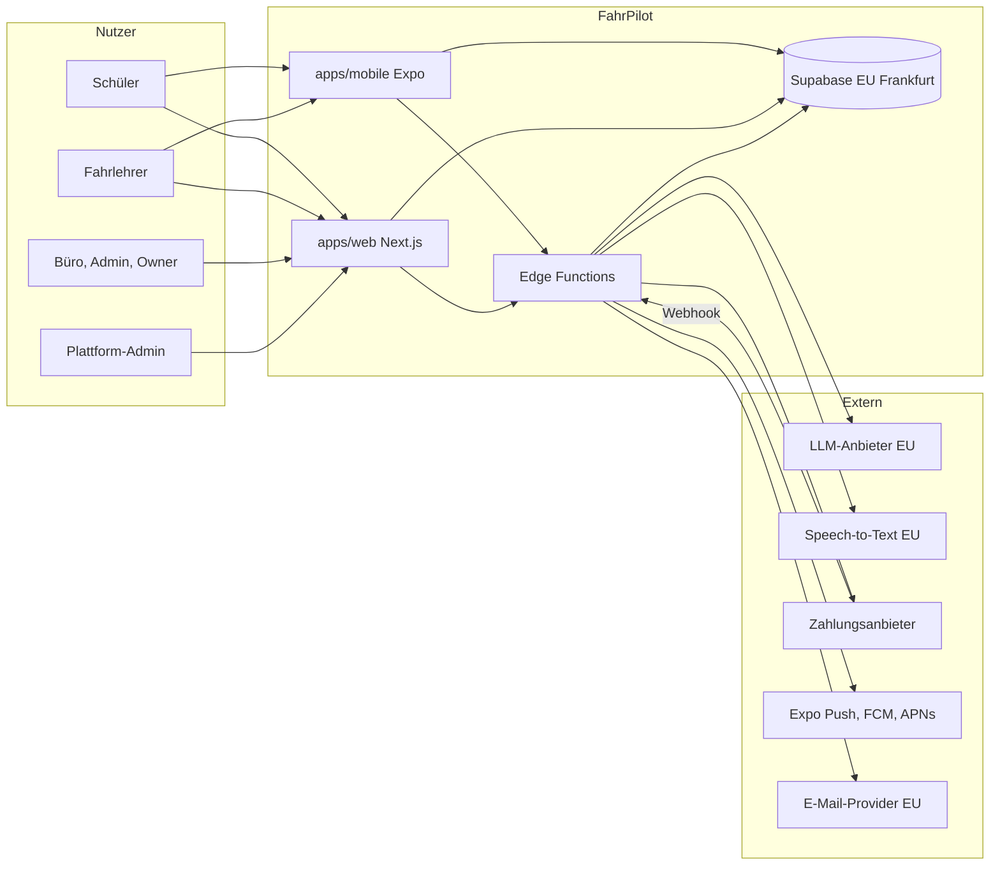
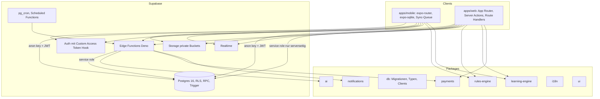
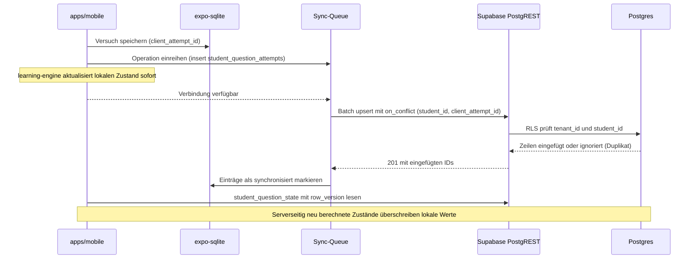
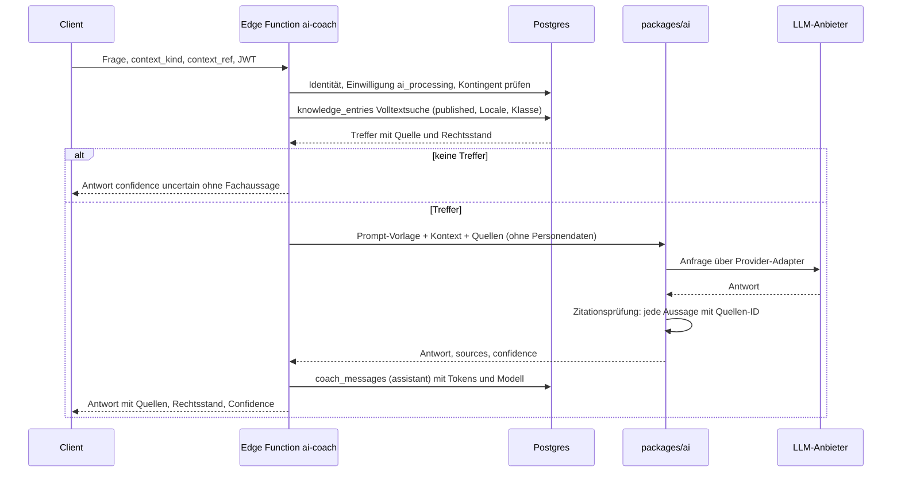
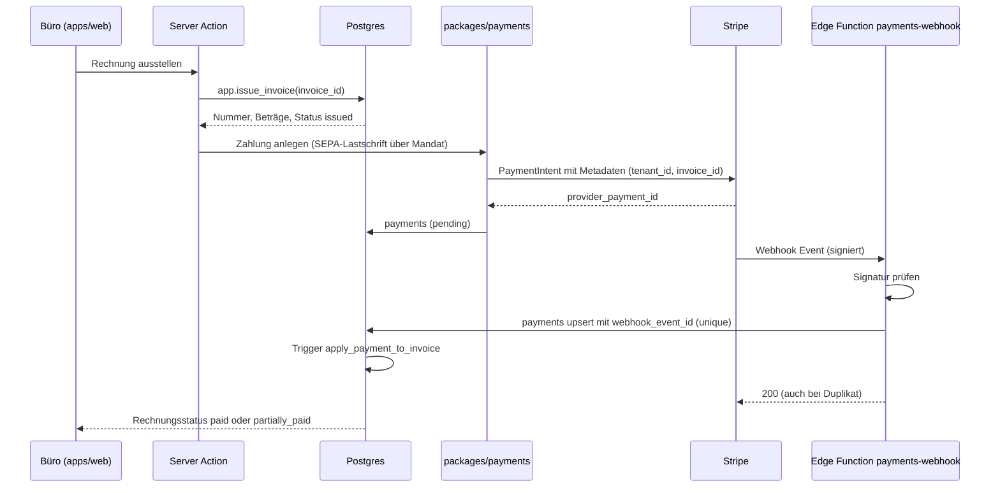

# FahrPilot: Architektur

Stand: September 2026. Dieses Dokument beschreibt die Zielarchitektur der Plattform: Systemkontext, Container, Datenflüsse, Monorepo-Struktur, Backend auf Supabase, Sicherheits- und Datenschutzkonzept, Offline-Modus, Performance, Deployment und Zukunftsvorbereitung. Es baut auf 00-spezifikationsanalyse.md, 01-informationsarchitektur.md, 02-user-flows.md und dem Datenmodell in 03-datenmodell.md auf.

## 1. Zielarchitektur

### 1.1 Systemkontext



### 1.2 Container



Kernaussagen:

1. Die Datenbank ist die Sicherheitsgrenze. Clients sprechen mit dem anon key und ihrem JWT direkt mit PostgREST; RLS und die RPC-Funktionen entscheiden, was sichtbar und erlaubt ist.
2. Integritätskritische Abläufe (Buchung, Storno, Check-in, Rechnungsausstellung) laufen ausschließlich als Datenbankfunktionen (0010), nie als Client-Logik.
3. Alles, was Geheimnisse braucht (LLM, Zahlungsanbieter, Push, E-Mail, Service-Role), läuft in Edge Functions oder in Next.js-Serverkontexten.
4. Fachlogik ohne Geheimnisse (Regelbewertung, Spaced Repetition, Prüfungsreife, Priorisierung) lebt in reinen TypeScript-Packages und wird auf Client und Server identisch ausgeführt.

### 1.3 Datenfluss Offline-Sync (Lernversuche)



### 1.4 KI-Anfrage mit Guardrails



### 1.5 Zahlung mit Webhook



## 2. Monorepo-Struktur (verbindlich)

Werkzeuge: pnpm Workspaces, Turborepo für Pipelines (build, lint, typecheck, test), TypeScript strict in allen Paketen, ESLint und Prettier zentral konfiguriert.

```
fahrpilot/
  apps/
    web/                 Next.js App Router, TypeScript, Tailwind v4
      app/(instructor)/  Fahrlehrer-Web
      app/(office)/      Büro und Admin
      app/(owner)/       Owner: Standorte, Rollen, Analytics, Abrechnung
      app/(platform)/    Plattform-CMS: Fragen, Regelversionen, Wissensbasis, Tenants
      app/(student)/     Schüler-Web: Lernen, Termine, Finanzen, Profil
      app/api/           Route Handlers (Webhooks-Proxy, Exporte)
    mobile/              Expo React Native mit expo-router
      app/(student)/     Tab-Navigation Heute, Lernen, Fahren, Finanzen, Profil
      app/(instructor)/  Tab-Navigation Heute, Schüler, Kalender, Dokumentation, Nachrichten
      src/offline/       expo-sqlite-Schema, Sync-Queue, Content-Bundles
  packages/
    rules-engine/
    learning-engine/
    db/
    ai/
    payments/
    notifications/
    i18n/
    ui/
  supabase/
    migrations/          0001 bis 0010 (verbindlich, getestet)
    functions/           Edge Functions (Deno)
    test/                SQL-Integrationstests
```

| Package | Inhalt | Regeln |
|---|---|---|
| apps/web | Fahrlehrer-Web, Büro/Admin, Owner, Plattform-CMS, Schüler-Web als Route-Groups mit serverseitig aus dem JWT abgeleiteter Navigation | Server Components lesen mit dem Nutzer-JWT; Server Actions rufen Package-Logik und RPCs; Service-Role nur in klar markierten Server-Modulen (server-only) |
| apps/mobile | Schüler-App und Fahrlehrer unterwegs; Offline mit expo-sqlite und Sync-Queue; Push-Registrierung; QR-Scanner; Sprachaufnahme (A2) | Kein Service-Role-Key im Bundle; alle Schreibzugriffe über RLS oder RPC; Content-Bundles mit Versionsstempel |
| packages/rules-engine | Versionierte Prüfungs- und Ausbildungsregeln: Zod-Schemas je rule_type für die Payloads, Auflösung von base_class-Vererbung, Bewertung von Prüfungssimulationen (Fehlerpunkte, Zwei-Fünf-Punkte-Regel, Grund-/Zusatzstoff), Ausbildungsstand aus Einheiten, Fristenberechnung | Reines TypeScript ohne I/O; Eingabe ist ein rule_versions-Datensatz oder rule_snapshot; jede Funktion gibt die verwendete Regelversion zurück |
| packages/learning-engine | Spaced Repetition als SM-2-Variante (ease, interval_days, due_at, Sicherheit als Qualitätssignal), Mastery Score je Frage und Thema, Prüfungsreife 0 bis 100 mit transparenten Faktoren (Coverage, Mastery, Simulationsergebnisse, Fehlertrend, Praxis-Skills), Fehleranalyse nach Themen, Heute-Modus-Priorisierung, Kostenprognose aus Preisliste und Ausbildungsstand | Deterministisch, testbar mit Fixtures; identische Ergebnisse auf Client (Offline) und Server (Cron); engine_version wird in readiness_snapshots gespeichert |
| packages/db | Migrationen (Quelle: supabase/migrations), generierte Supabase-Typen, typisierte Clients (browser, server, service), Hilfsfunktionen für RPC-Aufrufe mit typisierten Fehlern | Typen werden in CI aus dem Schema generiert; Abweichung schlägt fehl |
| packages/ai | Provider-Abstraktion mit Anthropic-Adapter als Standard und OpenAI optional; Knowledge-Base-Retrieval über Postgres-Volltextsuche; Guardrails (nur Antworten mit Quellen, Confidence verified/partial/uncertain, Zitationsprüfung, Ablehnung außerhalb der Domäne); Speech-to-Text-Adapter; Prompt-Vorlagen für Coach, Warum-Button, Fehleranalyse, Sprachnotiz-Strukturierung, Prüfer-Fragen-Bewertung, Fahrlehrer-Abfragen als strukturierte Query-Übersetzung (Zod-validiertes Query-Objekt statt freiem SQL) | Nur serverseitig importierbar; keine Personendaten im Prompt außer notwendigem Kontext; Kosten je Anfrage werden zurückgegeben |
| packages/payments | PaymentProvider-Interface (createMandate, createPayment, refund, parseWebhook), Stripe-Adapter mit SEPA-Lastschrift, Webhook-Idempotenz über payments.webhook_event_id, Rechnungs-PDF-Erzeugung mit versionierten Vorlagen, Vorbereitung E-Rechnung | Keine Speicherung von Zahlungsmitteldaten; Provider austauschbar |
| packages/notifications | Kanal-Adapter: Expo Push als Start, FCM/APNs-Adapter, E-Mail-Adapter; Rendering aus notification_type mit i18n; Ruhezeiten, Präferenzen, dedupe_key, E-Mail-Fallback bei Push-Fehler | Versandstatus wird in notifications.sent_at protokolliert |
| packages/i18n | Übersetzungen de, en, tr, ar mit RTL-Unterstützung; Namensräume je Feature; Intl-Formatierung de-DE als Standard | CI-Test auf fehlende Schlüssel; Rechtsstand und Regelversionen werden nicht übersetzt |
| packages/ui | Design-Tokens (Farben, Typografie, Abstände, Radien, Bewegungsdauern) als Quelle für Web (Tailwind v4 Theme) und Mobile (Token-Objekt); Web-Komponenten (Formulare, Tabellen, Kalender, Ampel, Skeletons); logische Layout-Eigenschaften für RTL | WCAG 2.1 AA als Abnahmekriterium jeder Komponente |

## 3. Backend auf Supabase

| Baustein | Entscheidung |
|---|---|
| Region | EU (Frankfurt) für alle Umgebungen; keine Subprozessoren außerhalb der EU |
| Datenbank | Postgres 16 mit pgcrypto, btree_gist, pg_trgm, citext; Schema app für Helfer, Typen und RPC; Schema public für Tabellen; RLS aktiviert und erzwungen auf allen Tabellen |
| Auth | E-Mail/Passwort, Magic Link, optional OAuth (nur mit EU-Verarbeitung); Custom Access Token Hook setzt tenant_id, tenant_role, platform_admin; MFA (TOTP) für office, admin, owner und platform_admin empfohlen und in der Web-App erzwungen; Session-Dauer kurz mit Refresh |
| Storage | Private Buckets: documents, avatars, question-media, lesson-audio (A2), invoices, exports. Pfadschema tenant_id/student_id/... beziehungsweise tenant_id/... ; Storage-Policies prüfen das erste Pfadsegment gegen app.current_tenant_id() und das zweite gegen app.current_student_id() oder Office-Rolle; signierte URLs mit kurzer Laufzeit; Audio wird nach bestätigter Transkription gelöscht |
| Realtime | Kanäle je Konversation (messages) und je Nutzer (notifications); Autorisierung über RLS der zugrunde liegenden Tabellen; kein Broadcast von Personendaten über tenant-übergreifende Kanäle |
| Edge Functions (Deno) | ai-coach, ai-error-analysis, ai-voice-note, ai-instructor-query, payments-webhook, payments-create, push-dispatch, email-dispatch, tenant-switch, data-export, data-deletion, readiness-recompute, reminders |
| Cron | pg_cron beziehungsweise Scheduled Functions: Terminerinnerungen (24 h und 2 h), Lernerinnerungen, Prüfungs-Countdown, Mahnläufe (A2), Fahrzeug-Erinnerungen (HU, Wartung, Reifen, Versicherung), Readiness-Neuberechnung (nächtlich und ereignisgesteuert), Ablauf von Wartelistenangeboten, Löschläufe gemäß retention_policies |

### 3.1 Serverlogik-Regel

1. Domänenlogik lebt in Packages (reines TypeScript, unit-getestet). Sie wird aus Next.js Server Actions und Route Handlers sowie aus Edge Functions aufgerufen und kann im Client ausgeführt werden, wenn keine Geheimnisse nötig sind (Offline-Bewertung, Priorisierung).
2. Der Service-Role-Key existiert nur serverseitig (Edge Functions, server-only-Module in apps/web). Jede Verwendung setzt tenant_id explizit und wird im Audit-Log mit request_id nachvollziehbar.
3. Clients nutzen ausschließlich anon key plus Nutzer-JWT. Was RLS nicht erlaubt, ist im Client nicht möglich; Bedienelemente werden aus der Rolle im JWT abgeleitet, die Durchsetzung erfolgt in der Datenbank.
4. Integritätskritische Abläufe sind RPC-Funktionen mit eigener Berechtigungsprüfung und Zeilensperren (book_lesson, cancel_lesson, create_checkin_token, checkin_theory_class, issue_invoice).
5. Jede neue Tabelle mit tenant_id benötigt Policies und den Tenant-Trigger; ein Migrations-Lint in CI prüft das.

## 4. Sicherheit und DSGVO

| Bereich | Maßnahme |
|---|---|
| Verschlüsselung | TLS für alle Verbindungen; Verschlüsselung at Rest durch Supabase; signierte Storage-URLs; keine Klartext-Tokens (Check-in-Codes als SHA-256-Hash, IP nur als Hash) |
| Secrets | Supabase Vault beziehungsweise Umgebungsvariablen der Plattform; kein Secret im Repository; Rotation dokumentiert; Service-Role-Key nie im Client-Bundle (Build-Prüfung) |
| Rate-Limits | Auth-Limits von Supabase; Edge Functions mit Limits je Nutzer und Tenant (KI-Anfragen, Check-in-Versuche, Exporte); Kontingent für KI je Schüler und Budget je Tenant |
| Audit-Logs | Trigger auf 26 Tabellen; append-only; Admin-Lesezugriff je Tenant; request_id aus Header x-request-id für Korrelation mit Anwendungslogs |
| Datensparsamkeit | Zahlungsmitteldaten beim Anbieter; Geofence nur als Distanz; KI-Prompts ohne Namen; E-Mails ohne Lerninhalte; Audit ohne notes_internal und ai_transcript |
| Löschkonzept | retention_policies je Datenkategorie (Rechnungen 120 Monate als published, übrige Kategorien needs_verification); data_requests mit legal_hold_until; Pseudonymisierung statt Löschung bei Aufbewahrungspflichten; Löschprotokoll im Audit-Log |
| Export | data_requests kind export; Edge Function data-export erzeugt maschinenlesbares Paket (JSON und PDF) im Bucket exports mit signierter URL und Ablauf |
| Einwilligungen | consents mit consent_type, text_version, granted_at, revoked_at; Verarbeitungen mit Einwilligungspflicht (ai_processing, push_notifications, photo_usage, marketing_email) prüfen vor Ausführung den aktuellen Stand |
| Verträge | AVV mit Supabase und allen Subprozessoren (LLM, Speech-to-Text, Zahlungsanbieter, Push, E-Mail); eigener AVV der Plattform gegenüber jeder Fahrschule mit Subprozessorliste |
| DSFA | Empfehlung: Datenschutz-Folgenabschätzung vor Ausbaustufe 2 (KI-Auswertung von Lernverhalten, Sprachaufnahmen, Standortdaten, Minderjährige); fachlich durch Datenschutzberatung zu begleiten |

### 4.1 Threat-Model-Kurzfassung

| Bedrohung | Angriffsweg | Gegenmaßnahme |
|---|---|---|
| Tenant-Confusion | Manipulierte tenant_id im Request oder fehlende Policy auf neuer Tabelle | tenant_id kommt nur aus dem JWT (Hook), Trigger enforce_tenant_on_write, force row level security, Migrations-Lint, Isolationstests in CI (Test 1) |
| IDOR | Direkter Zugriff auf fremde IDs (Rechnung, Dokument, Stunde) | RLS auf Zeilenebene mit student_id = app.current_student_id(); Storage-Policies auf Pfadpräfix; RPCs prüfen Eigentum |
| QR-Missbrauch | Weitergabe des Check-in-Codes, Check-in ohne Anwesenheit | Rotierender Code mit TTL bis 600 Sekunden, Hash statt Klartext, Zeitfenster um den Unterricht, Gerätefingerabdruck je Unterricht, optional Geo-Distanz, Nachträge nur durch Staff mit Audit |
| Webhook-Replay | Wiederholtes oder gefälschtes Zahlungsereignis | Signaturprüfung des Anbieters, webhook_event_id unique, idempotente Verarbeitung, Betragsabgleich mit Rechnung |
| Prompt-Injection in KI | Schädliche Anweisungen in Nutzerfragen, Sprachnotizen oder Wissensbasis-Text | Systemprompt trennt Anweisungen von Daten; Wissensbasis nur published; Antworten nur mit Quellen-IDs aus dem Retrieval; strukturierte Ausgaben mit Zod-Validierung; Fahrlehrer-Abfragen als Query-Objekt, nie als SQL; keine Werkzeuge mit Schreibzugriff |
| Token-Diebstahl | Gestohlenes JWT oder Refresh-Token | Kurze Laufzeit, Refresh-Rotation, MFA für Mitarbeiter, Geräte-Hinweis (account.security), Widerruf über Supabase Auth |
| Privilege Escalation | Nutzer setzt is_platform_admin oder ändert Rolle | Policy users_update_self fixiert is_platform_admin; tenant_memberships nur durch Admin; Hook liest Rolle aus der Datenbank, nicht aus Client-Daten |
| Rechnungsmanipulation | Änderung ausgestellter Rechnungen, Nummernlücken | Trigger protect_issued_invoice, invoice_counters ohne Rechte für authenticated, Positionen nur im Entwurf änderbar |

## 5. Offline-Modus

Umfang: Die Schüler-App funktioniert offline für Lernen nach Themen, Lernmodi, Prüfungssimulation, Statistiken aus lokalen Daten, Anzeige von Terminen und Rechnungen aus dem Cache. Die Fahrlehrer-App zeigt den Tagesplan aus dem Cache; Schnell-Dokumentation offline folgt in Ausbaustufe 2. Nicht offline: Buchen, Stornieren, Check-in, Zahlung, Chat-Versand (wird eingereiht), KI.

Sync-Queue-Format (expo-sqlite, Tabelle sync_queue):

| Feld | Bedeutung |
|---|---|
| id | lokale laufende Nummer, Verarbeitungsreihenfolge |
| operation | insert_attempts, upsert_session, upsert_state, insert_exam_simulation, insert_exam_results, insert_xp_event, upsert_daily_goal, insert_message, update_profile |
| table | Zieltabelle |
| payload | JSON der Zeilen inklusive Idempotenzschlüssel |
| idempotency_key | client_attempt_id, client_session_id, client_event_id, client_request_id oder client_message_id |
| row_version | bei Stammdaten: gelesene Version für Optimistic Locking |
| created_at, attempts, last_error, status | Verarbeitungsstatus (pending, sent, done, conflict, failed) |

Konfliktregeln:

1. Lernversuche, XP-Ereignisse, Simulationen und Ergebnisse sind append-only. Der Server merged über die unique-Constraints (student_id, client_*); Duplikate werden ignoriert. Reihenfolge ist unerheblich, da answered_at vom Client mitgegeben wird.
2. Verdichtete Zustände (student_question_state, student_topic_mastery, student_streaks) werden lokal von learning-engine berechnet und nach dem Sync vom Server neu gelesen. Der Server gilt als Wahrheit; die Berechnung ist deterministisch, sodass beide Seiten bei vollständiger Historie zum selben Ergebnis kommen.
3. Profil- und Stammdaten (students, student_licenses, lessons, lesson_evaluations) tragen row_version. Der Client sendet die gelesene Version; weicht sie ab, gewinnt der Server, der Client zeigt „Auf dem Server gibt es eine neuere Version" und bietet Übernahme oder erneutes Bearbeiten an.
4. Nachrichten werden mit client_message_id eingereiht und nach dem Senden anhand der Server-ID ersetzt.
5. Simulationen speichern rule_version_id und rule_snapshot lokal, damit ein offline abgeschlossenes Ergebnis mit derselben Regel bewertet wird, die beim Start galt.

Content-Bundles: Fragen, Versionen, Antworten, Themen, Kapitel und Medien werden je Klasse und Locale als Bundle mit Versionsstempel (höchste updated_at und Anzahl published-Versionen) geladen. Der Client vergleicht den Stempel beim Start und lädt nur Deltas. Nicht mehr gültige Versionen (valid_until überschritten) werden lokal als inaktiv markiert, bleiben aber für die Anzeige alter Versuche erhalten.

## 6. Performance

| Ziel | Maßnahme |
|---|---|
| App-Start unter 2 Sekunden bis zum Heute-Screen (warm) | Heute-Daten aus SQLite rendern, Netzwerk im Hintergrund; Content-Bundles bei Bedarf; Hermes, keine synchronen Initialisierungen |
| Frageansicht ohne wahrnehmbare Latenz | Fragen lokal; Bilder vorab komprimiert (WebP, Breite auf Zielgeräte begrenzt), Cache mit Ablauf |
| Büro-Listen unter 500 ms Serverzeit | Keyset-Pagination (created_at, id) statt Offset; Indizes auf (tenant_id, status) und Namen; Server Components mit Streaming |
| Kalender über alle Fahrlehrer | GiST-Index (tenant_id, period); Abfrage je Woche; Realtime-Updates nur für sichtbaren Zeitraum |
| KI-Antwort unter 5 Sekunden | Retrieval auf GIN-Index; Streaming der Antwort; Kontingent und Caching gleicher Fragen je Knowledge-Version |
| Caching | Next.js Data Cache für globale Inhalte (Regeln, Themen) mit Tag-Invalidierung bei Veröffentlichung; kein Cache für tenant-bezogene Personendaten über Nutzergrenzen hinweg |
| Bildkomprimierung | Upload-Pipeline im Client (Größe, Qualität) und serverseitige Prüfung von MIME und Größe; Dokumente als PDF oder Bild bis zu einer konfigurierten Grenze |
| Datenbankwachstum | Partitionierung von student_question_attempts und audit_logs (siehe 03-datenmodell.md Abschnitt 7), Archivierung nach retention_policies |

## 7. Deployment

| Thema | Entscheidung |
|---|---|
| Web | Vercel (Region Frankfurt) oder Container (Docker, Node) bei Bedarf eigener Infrastruktur; Umgebungsvariablen je Umgebung; Preview-Deployments je Pull Request gegen Staging-Supabase |
| Mobile | EAS Build und EAS Submit; Kanäle development, preview, production; OTA-Updates nur für JavaScript-Änderungen ohne native Änderungen; Versionsstempel der Content-Bundles unabhängig von App-Version |
| Supabase | Getrennte Projekte dev, staging, prod in Frankfurt; keine Produktionsdaten in dev/staging; Testdaten nur in Test und Staging mit Kennzeichnung |
| Migrationen | supabase CLI: Migrationen in supabase/migrations, lokal mit supabase db reset beziehungsweise reset-local.sh, Staging über supabase db push aus CI, Produktion nur nach Freigabe mit Backup-Punkt; keine Änderung bestehender Migrationen nach Ausführung in Staging |
| CI (GitHub Actions) | Lint, Typecheck, Unit-Tests (rules-engine, learning-engine, ai, payments), SQL-Tests gegen Postgres-Service (supabase/test), Typgenerierung mit Diff-Prüfung, E2E mit Playwright gegen Preview, Accessibility-Prüfung (axe), Build von Web und Mobile; Merge nur bei grünem Lauf |
| Observability | Sentry für Web, Mobile und Edge Functions (ohne Personendaten in Events); strukturierte Logs mit request_id; Supabase-Logs und Metriken; Alarme für Fehlerraten, Webhook-Fehler, Cron-Ausfälle |
| Backups | Tägliche Backups und Point-in-Time-Recovery in Produktion; RPO und RTO mit dem Kunden festzulegen; Wiederherstellungstest je Quartal |

## 8. Zukunft

| Thema | Vorbereitung jetzt | Umsetzung später |
|---|---|---|
| Mandantenfähige White-Label-Themes | Design-Tokens in packages/ui; driving_schools.settings für Logo, Farben, App-Name | Theme-Auflösung je Tenant zur Laufzeit im Web; separate App-Builds je Marke nur bei Bedarf |
| Partner-API | Interne Schnittstellen bereits als RPC und typisierte Funktionen; OpenAPI-Vertrag als Dokument | OAuth-Client-Credentials, Scoped API Keys je Tenant (Tabelle api_keys mit Hash und Scopes), Rate-Limits, Versionierung |
| Weitere Länder | Regel-Engine mit Klassen- und Regeltyp-Dimension; Zeitzone je Tenant; i18n | Länderdimension in rule_versions und licenses (country_code), Regelsets je Land, lokale Prüfungsorganisationen als Adapter |
| CarPlay und Android Auto | Termine und Erinnerungen als klar getrennte Datenquelle (lessons, notifications) | Nur sichere Funktionen: nächster Termin, Navigation zum Treffpunkt, Erinnerungen; keine Lerninhalte während der Fahrt |
| Franchise und Mehrmarken | tenant_memberships und Owner-Rolle | Tenant-Gruppen mit aggregierter Analytics ohne Personendaten über Gruppen hinweg |
